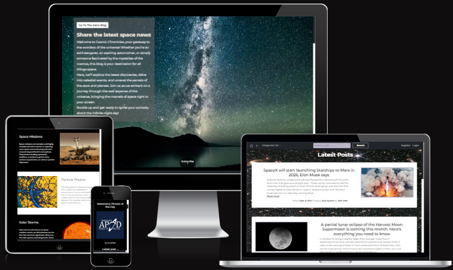
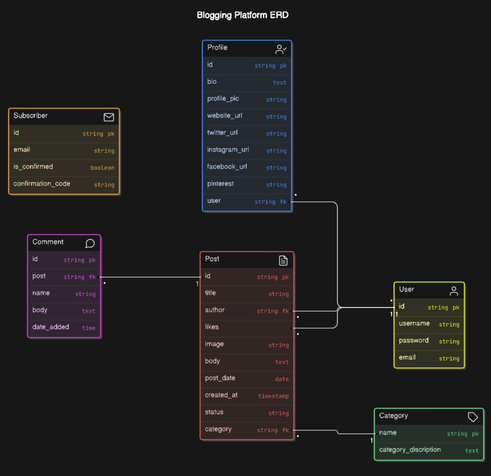
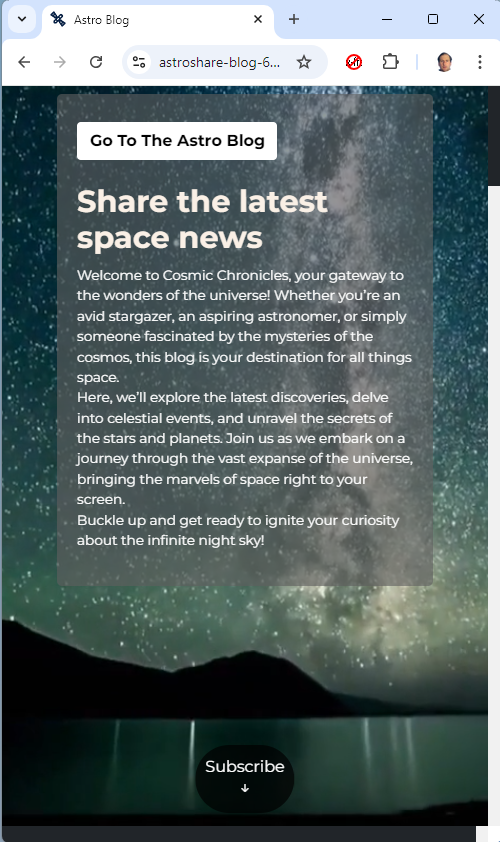
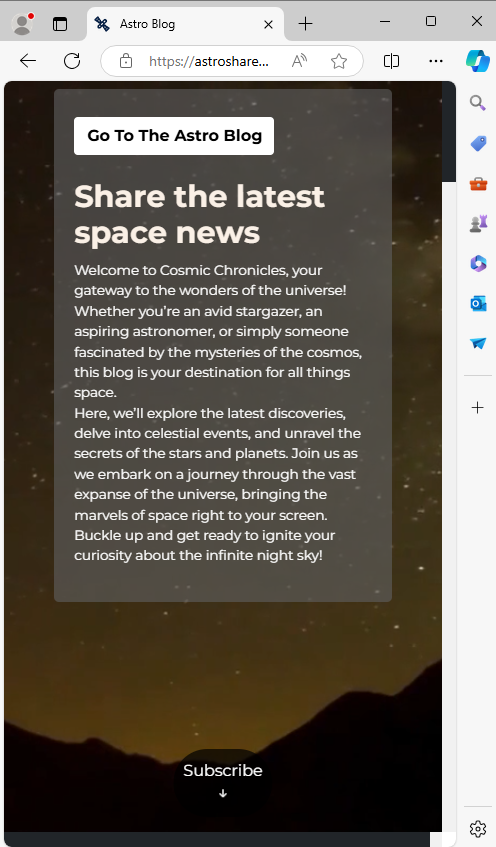
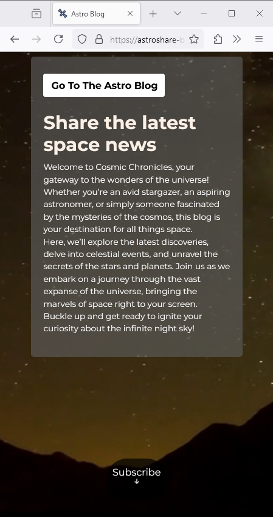
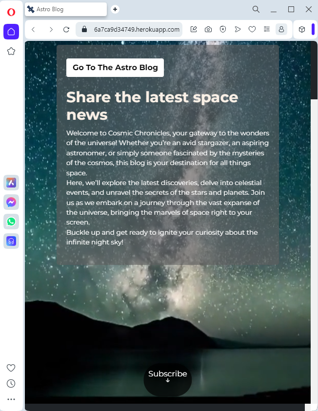
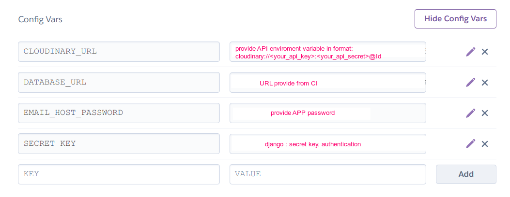

# AstroShare Blog

AstroShare Blog is a fictional blog posting news site where information on astronomically related topics can be discussed and verified users can blog posts. There are a number of categories to choose from. 
There is a comments section below each post. The idea is basically to create the ultimate space blog and discussion center for enthusiasts, experts and curious minds alike! Here users can post, read and comment on the latest news stories about space exploration, astronomy and much more. 
Each post is tagged by topic, making it easy to navigate through categories like 'Astronomy', 'Space Emissions', 'Astrophysics' and more. Posts can be voted up or down, with the most engaging content highlighted. 
Users can also leave comments on posts to join the conversation. Every post and comment is timestamped, which promotes real-time discussions and builds a vibrant, interactive community around space topics.

A live version of the project can be accessed here: [AstroShare Blog](https://astroshare-blog-6a7ca9d34749.herokuapp.com/)

# Table Of Contents
  - [AstroShare Blog](#astroshare-blog)
  - [Development Tools](#development-tools)
  - [CSS Management for Project Structure](#css-management-for-project-structure)
    - [Index Page Overview](#index-page-overview)
    - [Front Page Overview](#front-page-overview)
    - [Mobile first design](#mobile-first-design)
  - [Colors](#colors)
    - [Color Customization Process](#color-customization-process)  
  - [Technologies Used](#technologies-used)
    - [Wireframes](#wireframes)
      - [Wireframes for Homepage & Frontpage](#wireframes-for-homepage--frontpage)
    - [Favicon](#favicon)
    - [Languages](#languages)
    - [Frameworks & Software](#frameworks--software)
    - [The Structure Plane - Site maps](#the-structure-plane---site-maps)
    - [The Structure Plane - Database](#the-structure-plane---database)
      - [Database](#database)
  - [UX & Agile](#ux--agile)
  - [Testing](#testing)
    - [HTML Validation](#html-validation)
    - [CSS Validation](#css-validation)
    - [Accessibility](#accessibility)
    - [Wave Validation](#wave-validation) 
    - [Lighthouse Validation](#lighthouse-validation)
    - [JSHint Validation](#jshint-validation)
    - [Device Testing](#device-testing)
    - [Browser Compatibility](#browser-compatibility)
    - [PEP8](#pep8)
    - [Device Test](#device-testing)
    - [User Stories Testing](#user-story-testing)
  - [Deployment](#deployment)
    - [Heroku Deployment](#heroku-deployment)
    - [Local deployment](#local-deployment)
    - [Forking this GitHub repository](#forking-this-github-repository)
    - [Clone this repository](#clone-this-repository)
    - [Cloudinary](#cloudinary)
    - [Create PostgreSQL using Code Institute Database](#create-a-new-postgresql-code-institute-database)
    - [Gmail](#gmail)    
  - [License](#license)
  - [Credits](#credits)

## Development Tools

- **Bootstrap:** Bootstrap is a popular front-end development framework that helps developers create responsive, mobile-first websites quickly and efficiently. It provides a collection of pre-designed HTML, CSS, and JavaScript components like buttons, forms, navigation bars, and grid layouts. By using Bootstrap, developers can build modern, visually consistent web pages without writing extensive custom code. It's widely appreciated for its ease of use, customization options, and ability to adapt to various screen sizes, making it a go-to tool for fast web development.
- **Modular Design:** Modular design is a system design approach that divides a system into independent, interchangeable modules. Each module performs a specific function, enabling flexibility, easy maintenance, scalability, and reusability.
- **Consistent Aesthetic:** To maintaining a unified and cohesive visual style across all elements of a design. This includes consistent use of colors, fonts, shapes, and layout, ensuring that all components appear harmonious. It enhances user experience by creating familiarity and brand identity, making designs more professional and visually appealing.

[Table Of Contents](#table-of-contents)

## CSS Management for Project Structure

In my project, I decided to use a single CSS file, styles.css, to manage all the styling across the application.
These variables are defined within styles.css, and ensuring they work correctly is crucial for applying themes consistently across the site.

By consolidating all the styles into one file, I make managing themes straightforward. If I need to switch themes or make adjustments, I only need to modify this single CSS file, which allows for a seamless transition to a new look and feel across the entire application. This approach not only simplifies maintenance but also reinforces my focus on code reuse and consistency.

Additionally, having a single CSS file helps me avoid complications related to injecting styles through Bootstrap, ensuring that the CSS variables function as intended throughout the application.

### Index Page Overview

The homepage starts with a 'hero section' featuring an embedded video stream in replay, along with a parallax effect designed to captivate visitors. This section offers users the option to engage with the Blog Post.

Following this, the AstroBlog section provides a brief introduction to the purpose of the site, helping visitors quickly understand what the site is about.

To build more interest, I have incorporated an 'Astronomy Picture of the Day' (APOD) section where users and visitors always have a new astronomical item to explore, providing an easy and quick overview of the latest posts.

In a zigzag pattern, the most popular categories are displayed on the homepage. To encourage further engagement with the blog, a "Latest Contributors" section is also included.

For astronomical enthusiasts, a nice widget is incorporated that tracks the current position of the International Space Station (ISS). When clicking on the 'Go To the ISS' button, a new page appears with an independently generated world map showing the ISS’s location.

At the bottom of the page, I have included a subscription section where users can join the mailing list to receive newsletters, information, and relevant benefits.

Finally, the page concludes with a footer that reinforces credibility and includes essential links, such as the social media links for the AstroBlog.

### Front Page Overview
The **Front Page** is designed to give a quick overview of a list of 5 blog posts ranked by the date added, with the most recent post at the top of the page.

1. **NavBar**: The 'navbar' has a dual function and can be used by both visitors and authenticated users.
   - Visitors can quickly navigate back to the "homepage" by clicking the home icon or to the 'front page blog posts' by clicking the left arrow icon.
   - **For Visitors**: Visitors can always read posts but cannot participate. They have the option to view posts by category or to join Astro Blog by registering.
   - **For Users**: Users have full CRUD (Create, Read, Update, Delete) functionality for their own posts. The 'Add Post' option appears, and they see 'Logged in as,' giving them the ability to change their profile settings and details.

2. **Blog Post Snippets**: Each blog post is presented as a snippet along with a corresponding image.
   - **For Visitors**: The `[read more]` link redirects to the article detail page where the full post can be read.
   - **For Users**: Users have the same functionality as visitors, but on the redirected page, they have full control over their posts.

3. **Detailed Article Posts**: On this page, each post is treated individually.
   - **For Visitors**: Visitors can read the full blog post and any comments (if available). They cannot like or comment on posts. Visitors can click on the author's name to view the author’s profile page.
   - **For Users**: Users can read the post, comment, and 'Like' the posts. They can only 'Dislike' posts they have already liked.  
     The option to dislike posts outright is not part of the blog’s policy.

### Mobile first design
To ensure a seamless experience across devices, Bootstrap is used to make the Home- & Frontpage fully responsive. On mobile devices, the table features horizontal scrolling to prevent content compression, maintaining clarity and usability. Additionally, each table row highlights with a colour change on hover, making it easier for users to track their interactions as they navigate.

[Table Of Contents](#table-of-contents)

## Colors

The color palette for this project has been carefully selected to ensure a professional and clean aesthetic, aligning with the brand identity and enhancing user experience. Below is a breakdown of the primary colors used across the application:

- **Primary Color:** `#352F44` - Is a dark, muted purple with gray undertones, giving it a sophisticated, moody, and elegant feel. clarity and focus.
- 
- **Secondary Color:** `#5C5470` - (also atrribute color) Is a muted, medium-dark purple with gray undertones, offering a subtle and sophisticated appearance.
- 
- **Primary Color Highlight:** `#AD91FC` - Highlight color for hover effects, is a soft, pastel lavender with a light, calming appearance, often associated with a gentle, serene feel.
- 
- **Background Color:** `#B9B4C7` - is a soft, muted lavender-gray with cool undertones, giving it a calm and subtle appearance.
- 
- **Accent Color:** `#FAF0E06` - Is a soft, pale beige with warm undertones, often referred to as linen, giving it a light, neutral, and calming feel.
- 
- **Main Text Color:** `#FFFFFF` - Tis pure white, the brightest and most neutral color, representing simplicity, cleanliness, and clarity.
- 
- **Secondary Text Color:** `#000000` - (--main-text-color-invers) Is pure black, the darkest color, symbolizing elegance, power, and sophistication.
- 
- **Warning Color:** `#FF0000` - Is a bold, bright red, commonly associated with intensity, urgency, and passion.
- 
- **Dark Text Shadow:** `2px 2px 4px rgba(0, 0, 0, 0.5)` - A bolder text shadow used on white backgrounds, ensuring 
that text stands out clearly.
- 

This color palette was chosen not only for its visual appeal but also for its contribution to a cohesive and user-friendly interface, reinforcing the professional and serious tone of the application.

### Color Customization Process

The colour customization process in this project was designed to offer flexibility and personalisation. I have implemented a series of **CSS Variables** to define various colour palettes.

Key elements of the colour customization process include:

- **Multiple Colour Palettes**: I have created several distinct colour palettes, each with its unique style—ranging from more traditional to modern and alternative designs. The default palette, known as the **root palette**, is the primary theme that all users see upon first visiting the site.

- **CSS Variables**: The different colour palettes are implemented using CSS Variables, which allows for dynamic and flexible styling of various elements across the site. This ensures a consistent and responsive design while providing a personalised experience for each user.

[Table Of Contents](#table-of-contents)

## Technologies Used

### Wireframes

The wireframes for this project served as a crucial guide during the development process, essentially acting as a blueprint for the design and layout of the website. My focus was primarily on two key pages: the index (or homepage) and the frontpage blog post. Given the repetitive nature of the blog post, I decided that it was a better idea to separate the homepage and the frontpage. The homepage serves more as an introductory page, while the frontpage blog post is a more active working page for the blog posts.

I chose to highlight only two wireframes in this README as they are the most critical to the overall user experience. Other pages did not require such detailed wireframing and followed more standard, basic templates.

### Wireframes for Homepage & Frontpage

  
Wireframe for Homepage Desktop

  

 

  
Wireframe for Frontpage Blogpost Desktop

  

 

  
Wireframe for Homepage Responsive

  

 

  
Wireframe for Frontpage Blogpost Responsive
  
  

 

### Favicon

The favicon was created with [Favicon.io](https://favicon.io/favicon-generator/). 

  

### Languages
* [Python](https://en.wikipedia.org/wiki/Python_(programming_language)) - Provides the functionality for the site.
* [HTML5](https://en.wikipedia.org/wiki/HTML) - Provides the content and structure for the website.
* [CSS3](https://en.wikipedia.org/wiki/CSS) - Provides the styling for the website.
* [JavaScript](https://en.wikipedia.org/wiki/JavaScript) - Provides interactive elements of the website

### Frameworks & Software
* [Gitpod](http://gitpod.io) - Cloud based IDE
* [Bootstrap](https://getbootstrap.com/) - A CSS framework that helps building solid, responsive, mobile-first sites
  -  **Bootstrap:** Integrated to utilize its responsive grid system and pre-built components, ensuring the site is mobile-friendly and adaptable to different screen sizes.
* [Django](https://www.djangoproject.com/) - A model-view-template framework used to create the Review | Alliance site
* [Balsamiq](https://balsamiq.com/) - Used to create the wireframe.
* [Github](https://github.com/) - Used to host and edit the website.
* [Heroku](https://en.wikipedia.org/wiki/Heroku) - A cloud platform that the application is deployed to.
* [Lighthouse](https://developer.chrome.com/docs/lighthouse/overview/) - Used to test performance of site.
* [Responsive Design Checker](https://www.responsivedesignchecker.com/) - Used for responsiveness check.
* [Wave Web Accessibility Evaluation Tool](https://wave.webaim.org/) - Used to validate the sites accessibility.
* [Favicon](https://favicon.io/) - Used to create the favicon.
* [Google Chrome DevTools](https://developer.chrome.com/docs/devtools/) - Used to debug and test responsiveness.
* [ChatGPT](http://chatgpt.com) AI tool for troubleshooting and repetitive tasks.
* [HTML Validation](https://validator.w3.org/) - Used to validate HTML code
  -  **HTML:** The foundation for structuring the web pages, providing the semantic markup needed for the site's content.
* [CSS Validation](https://jigsaw.w3.org/css-validator/) - Used to validate CSS code
  -  **PostgreSQL:** The primary database used to store user data, blog post listings, article details, ... chosen for its flexibility and scalability.
* [PEP8 Validation](https://pep8ci.herokuapp.com/#) - Used to validate code 
* [JSHint Validation](https://jshint.com/) - Used to validate JavaScript code
  -  **JavaScript:** Employed to add interactivity and dynamic elements to the site, enhancing the user experience with features like form validation and asynchronous content updates.

[Table Of Contents](#table-of-contents)

### The Structure Plane - Site maps

The following site-maps show how the site is structured to logged in users whitout a profile, logged in users whit a profile and not logged in users.

  
Site Map - Logged In whitout a Profile

  

 

  
Site Map - Logged In whit a Profile

  

 

  
Site Map - Not Logged In

  

 

### The Structure Plane - Database

The database schema was created with [eraser](https://app.eraser.io/workspace/A4EDloZQMT27ohXOp7Vj)

  
ERD - Diagram

  

#### Database 

I used a PostgreSQL provided by Code Institute as relational database.

- **FieldTypes:** 
  - AutoField: An integer field that automatically increments.
  - CharField: A text field with a maximum length.
  - EmailField: A CharField that checks if the value is a valid email address.
  - DateTimeField: A field for storing date and time.
  - DateField: A field for storing dates.
  - TextField: A large text field.
  - OneToOneField: A one-to-one relationship.
  - ForeignKey: A many-to-one relationship.
  - IntegerField: An integer field.
  - DecimalField: A fixed-precision decimal number.
  - URLField: A CharField for URLs.
  - ResizedImageField: An image field with resizing options. 

- **Relationships:** 
  - A User has one UserProfile.
  - A UserProfile belongs to one User.
  - A User has one Author name
  - A Post category can have only one Categort
  - A Comment is only linked to one Post.
  - A Post like can belong to many Users.

[Table Of Contents](#table-of-contents)

## UX & Agile
- The complete User Experience and Agile methology are explained to this link [here](AGILE.md)

## Testing

### HTML Validation

All pages have been passed through the [W3C HTML Validator](https://validator.w3.org/) successfully save for a few minor issues which have been left 'as is' as attempts to correct them proved unsuccessful and lead to results which devalued the user experience. Specifically, these were:

I ensured that the HTML structure of AstroBlog adheres strictly to web standards. I utilized the W3C Validator to validate our HTML code, striving to minimize and eliminate all possible errors. There are many templates to consider but the main pages where is the focus of stite are the Homepage and the Frontpaga-Blogpost.
After experimenting whit different container layout and fixing all the issues validation results showed **zero errors**.

The detail of these test can evaluate on this link.

  
Click to view HTML Validation Homepage Result

  
   

   
  

### CSS Validation

    

The CSS of AstroBlog has been carefully crafted and validated to ensure it adheres to the highest standards. I utilized the W3C CSS Validator to check for any errors, and I'm pleased to report that our stylesheets passed with **zero errors**.

This thorough validation process ensures that the user interface is both visually appealing and fully compliant with modern web standards. We took particular care to validate our responsive design elements to ensure consistency across all devices.

Here’s the validation result:

  
Click to view CSS Validation Result

  

### Accessibility

Ensuring accessibility is a key priority for AstroBlog. We've taken great care to make sure our platform is inclusive and usable by as many people as possible, regardless of their abilities or the devices they are using.

Throughout the development process, we adhered to the Web Content Accessibility Guidelines (WCAG) to guarantee that our site meets accessibility standards. This includes:

- **Proper use of ARIA attributes:** We have utilized ARIA attributes effectively to enhance the accessibility of dynamic content and interactive elements, ensuring screen readers can accurately convey the information to users.
- **Keyboard Navigation:** All interactive elements, including forms, buttons, and navigation links, are fully accessible via keyboard navigation, making the site usable without a mouse.
- **Contrast Ratios:** We carefully selected our color scheme to ensure sufficient contrast between text and background colors, making the content readable for users with visual impairments.
- **Alt Text for Images:** All images include descriptive `alt` attributes, providing context to users who rely on screen readers.

These efforts help ensure that our site is not only compliant with accessibility standards but also provides an inclusive user experience. We continue to monitor and improve the accessibility of astroblog as we develop new features and enhancements.

[Table Of Contents](#table-of-contents)

### Wave Validation

I have conducted a thorough accessibility audit using the WAVE (Web Accessibility Evaluation Tool). There is a smooth transition between the header of the page and the rest of the main page. Nevertheless, there are some issues to address due to the background MPEG replay. WAVE is dynamic and cannot make a persistent measurement of background contrast.

 

I have also identified contrast issues with the modal buttons, which follow a similar color pattern to the Flash Danger alerts. However, the inclusion of shadow effects and other design enhancements significantly aids visibility. I believe these design choices ensure the buttons remain accessible and visually clear, even if they do not fully meet WAVE’s contrast recommendations.

 

Additionally, contrast warnings were noted in the Flash messages—interestingly, all colors except yellow were flagged. While we understand that white text on a transparent background might pose a readability challenge, WAVE does flaged it as an issue. Conversely, other colors, which do not seem problematic to us, were marked for contrast errors.

 

Overall, the WAVE validation confirms that our website adheres to accessibility standards, with only a few minor contrast issues that have been carefully considered in the design process. While we will continue exploring potential solutions to these issues, we have prioritized maintaining a visually cohesive and intuitive theme for the site.

Note: I'm fully aware of the contrast issues highlighted by the WAVE Validation Tool. It is my duty to address these in future updates to ensure an even higher level of accessibility across the entire platform. We appreciate the insights provided by the tool and will use this feedback to guide our ongoing improvements.

### Lighthouse Validation

My Lighthouse validation results have been very promising, with high scores across most categories. One area where I noticed a slightly lower score is in SEO, and I’m actively working on improvements to achieve even better results. Lighthouse has been instrumental in helping me organize my files and optimize for performance.

   
  
Click to view Lighthouse Homepage Result

  
   

 

   
  
Click to view Lighthouse Frontpage Result

  
   

 
A specific recommendation from Lighthouse was to use the WebP format for images to improve load times. In response, I made sure that all images served through the browser are now in WebP format. However, I also understand that too much compression could negatively impact the user experience, especially on larger screens. So, I made a conscious decision to balance performance with visual quality. After gathering feedback from a diverse group of users, I confirmed that the image quality is well-received across various devices. As a result, I decided to maintain slightly larger image sizes to prioritize a smooth and visually appealing experience, even if it means sacrificing a little bit of performance.

Additionally, Lighthouse suggested reducing the CSS payload, which I’m currently considering. One option I’m exploring is breaking the main styles.css file into smaller files tied to specific widgets. This would allow me to send only the necessary CSS for each page, potentially cutting down the overall size of the CSS file and improving load times.

While the desktop version scores are very high, the mobile version, although still passing, has some room for improvement. I’m committed to refining these areas to ensure the best possible experience across all devices.

### JSHint Validation

Although our project doesn't include an extensive amount of JavaScript, I canensured that the code we do have is fully validated using **JSHint**. I'm pleased to report that our JavaScript code has passed the validation process with a 100% clean bill of health—no errors whatsoever.

In addition to being error-free, the JavaScript code is thoroughly commented and documented. This will make it easier for future developers to understand the purpose and function of each part of the code.

### PEP8
All Python files as well env.py and manage.py, have been passed through the [Code Institute PEP8 Linter](https://pep8ci.herokuapp.com/). The only warnings given were for the settings.py file which contains a small number of long lines (i.e. greater than 80 characters) under AUTH_PASSWORD_VALIDATORS; as this is code implemented by Django itself at setup, these lines will be left unchanged. 

 

   
  
Click to view PEP8 Result

  PEP8 Compliant

  | Directory | File        | Check |
  | --------- | ----------- | ----- |
  | AstroBlog | Settings.py | PASS  |
  | AstroBlog | urls.py     | PASS  |
  | AstroBlog | env.py      | PASS  |
  | AstroBlog | manage.py   | PASS  |
  | Blogger   | admin.py    | PASS  |
  | Blogger   | apps.py     | PASS  |
  | Blogger   | forms.py    | PASS  |
  | Blogger   | models.py   | PASS  |
  | Blogger   | urls.py     | PASS  |
  | Blogger   | views.py    | PASS  |
  | Members   | admin.py    | PASS  |
  | Members   | apps.py     | PASS  |
  | Members   | forms.py    | PASS  |
   

### Device Testing

The website has undergone thorough testing across a variety of devices, including desktop computers, tablets, and smartphones. We focused on ensuring that the responsiveness of the site is consistent and effective across all screen sizes, providing an optimal user experience regardless of the device used.

To achieve this, we employed media queries to adapt the layout for different screen sizes. This approach ensures that when the device's dimensions fall within specific ranges, certain elements will reposition themselves, maintaining readability and proper alignment. 

For instance, on smaller screens, such as smartphones, we adjusted the distribution of content to ensure that all elements are easily accessible and clearly visible, avoiding any overlap or readability issues. The result is a fluid and intuitive experience across devices, meeting our goal of a responsive design that performs well on all tested platforms.

### Browser Compatibility

I have conducted extensive testing to ensure that the website is fully compatible across a range of web browsers. Specifically, the site has been tested on:

-  **Google Chrome**
-  **Microsoft Edge**
-  **Opera**
-  **Mozilla Firefox**

 

   
  
Click to view Google Browser Result

  
   

 

   
  
Click to view Edge Browser Result

  
   

 

   
  
Click to view FireFox Browser Result

  
   

 

   
  
Click to view Opera Browser Result

  
   

 

In each browser, the website performs smoothly, maintaining consistent functionality and appearance. We focused on ensuring that all features, from user registration to job application processes, operate seamlessly regardless of the browser used.

No significant issues were encountered during the tests, confirming that our site is accessible and reliable across these popular browsers. This ensures that users can interact with the platform without any unexpected disruptions, regardless of their preferred browser.

## User Story Testing

Manual Testing Result Report

 

Navbar

| Homepage – Template                                                    |                                                               |                                     |       |
| ---------------------------------------------------------------------- | ------------------------------------------------------------- | ----------------------------------- | ----- |
| Scenario                                                               | Action                                                        | Result                              | Check |
| Click the “Go To Blog” Button                                          | should navigate to Frontpage - Blogpost                       | Redirect to Blog                    | PASS  |
| Click “Subscribe”                                                      | Should navigate to Subscription                               | Redirect to section bottom homepage | PASS  |
| Click “Go to APOD”                                                     | Should navigate to Astronomy Picture of the Day               | Redirect to APOD page               | PASS  |
| Click “Go to ISS”                                                      | Should navigate to Track the International Space Station page | Redirect to ISS page                | PASS  |
| Fill in “Subscribe to our Newsletter”Fill in Name & Email after Submit | Should navigate to Check Email Page                           | Redirect to “Check your Email” page | PASS  |

| Frontpage – blogpost Template               |                                                                     |                                                               |       |
| ------------------------------------------- | ------------------------------------------------------------------- | ------------------------------------------------------------- | ----- |
| NavBar – if user is logged out (visitors)   |                                                                     |                                                               |       |
| Scenario                                    | Action                                                              | Result                                                        | Check |
| Click House Icon                            | Should navigate to “Homepage”                                       | Redirect to Homepage                                          | PASS  |
| Click Arrow Left                            | Should navigate to “Frontpage – Blogpost”                           | Redirect to Frontpage                                         | PASS  |
| Click Category List                         | Dropdown menu to filter specific blogpost categories                | Redirect to Posts per Categorie                               | PASS  |
| Click Category List – Blog Posts Categories | Dropdown menu to shows all aviable categories and there discription | Redirect to Category List Page                                | PASS  |
| Click Search Query                          | Search for specific key words in the Blogpost                       | Redirect to Search post list out of blogpost specific keyword | PASS  |
| Click Register                              | Should navigate to Register page                                    | Redirect to Register page                                     | PASS  |
| Click Login                                 | Should navigate to Login page                                       | Redirect to Login Page                                        | PASS  |

| Navbar – If first time user is Logged In (registered users) | [#20](https://github.com/Harmonica-Men/AstroShare-Blog/issues/20)                                       |                                  |       |
| ----------------------------------------------------------- | -------------------------------------- | -------------------------------- | ----- |
| Scenario                                                    | Action                                 | Result                           | Check |
| Click Logged is as: [user]                                  | Should navigate to Create Profile Page | Redirect to Create Profile Page  | PASS  |
| Click Add Post                                              | Should navigate to Add Post            | Redirect to Create Add Post Page | PASS  |

| NavBar – if after create a profile |                                      |                               |       |
| ---------------------------------- | ------------------------------------ | ----------------------------- | ----- |
| Scenario                           | Action                               | Result                        | Check |
| Click Logged is as: [user]         | Should navigate to Edit Profile Page | Redirect to Edit Profile Page | PASS  |

| Frontpage – Blogpost If [user] Not Logged In (Visitors) |                                             |                                  |       |
| ------------------------------------------------------- | ------------------------------------------- | -------------------------------- | ----- |
| Scenario                                                | Action                                      | Result                           | Check |
| Click [Read More]                                       | Should navigate to Article Detail Page      | Redirect to Article Details Page | PASS  |
| Click [Pagination buttons]                              | Should navigate to other Frontpage Blogpost | Redirect to Frontpage Blogpost   | PASS  |
| Back to Top                                             | Should navigate to top of Frontpage         | Redirect to Top op Frontpage     | PASS  |

| Frontpage – Blogpost If [user] Logged In (Users)     |                                          |                                   |       |
| ---------------------------------------------------- | ---------------------------------------- | --------------------------------- | ----- |
| Scenario                                             | Action                                   | Result                            | Check |
| Click “Edit” for which to user has create the post   | Should navigate to Edit Article Blogpost | Redirect to Edit Article Blogpost | PASS  |
| Click “Delete” for which to user has create the post | Should navigate to Delete Blogpost       | Redirect Delete to Blogpost       | PASS  |

| Addpost page Template | [#21](https://github.com/Harmonica-Men/AstroShare-Blog/issues/21)                                      |                                |       |
| --------------------- | ------------------------------------- | ------------------------------ | ----- |
| Scenario              | Action                                | Result                         | Check |
| Post                  | Should navigate to Add new post       | Redirect to Add Newpost        | PASS  |
| Back to Blog          | Should navigate to Frontpage Blogpost | Redirect to Frontpage Blogpost | PASS  |

| Article detail blog post              |                                        |                                |       |
| ------------------------------------- | -------------------------------------- | ------------------------------ | ----- |
| Scenario                              | Action                                 | Result                         | Check |
| Click high lighted author name        | Should navigate to Author Profile Page | Redirect to Profile Page       | PASS  |
| Click Like (visitors)                 | must be logged in to comment           | no redirect to comments        | PASS  |
| Click Like (only autheticated users)  | Like button availeble                  | increase counter total likes   | PASS  |
| Click unlike                          | Unlike button availeble                | decrease counter total likes   | PASS  |
| Add Comment (vistors)                 | not able to make a comment             | no redirect to comments        | PASS  |
| Add Comment (only autheticated users) | Should navigate to Add Comments        | Redirect to Add Comments       | PASS  |
| Back to Blog                          | Should navigate to Frontpage Blogpost  | Redirect to Frontpage Blogpost | PASS  |

| Add comment Template | [#10](https://github.com/Harmonica-Men/AstroShare-Blog/issues/10)                                      |                                |       |
| -------------------- | ------------------------------------- | ------------------------------ | ----- |
| Scenario             | Action                                | Re-Action                      | Check |
| Cick Add Comment     | Should navigate to Add Comment        | Redirect to Add Comment        | PASS  |
| Back to Blog         | Should navigate to Frontpage Blogpost | Redirect to Frontpage Blogpost | PASS  |

| Login Template | [#20](https://github.com/Harmonica-Men/AstroShare-Blog/issues/20)                                    |                                |       |
| -------------- | ----------------------------------- | ------------------------------ | ----- |
| Scenario       | Action                              | Result                         | Check |
| Click Login    | After Filled in correct credintials | Redirect to Frontpage Blogpost | PASS  |

| Register Template | [#20](https://github.com/Harmonica-Men/AstroShare-Blog/issues/20)                         |                   |       |
| ----------------- | ------------------------ | ----------------- | ----- |
| Scenario          | Action                   | Result            | Check |
| Click on Register | Should navigate to Login | Redirect to Login | PASS  |

| Author Profile Template |                                       |                                |       |
| ----------------------- | ------------------------------------- | ------------------------------ | ----- |
| Scenario                | Action                                | Result                         | Check |
| Click Twitter icon      | Should navigate to Twitter            | Redirect to Twitter            | PASS  |
| Click Instagram icon    | Should navigate to Instagram          | Redirect to Instagram          | PASS  |
| Click Facebook          | Should navigate to Facebook           | Redirect to Facebook           | PASS  |
| Click Globe             | Should navigate to Website            | Redirect to Codeinstiture      | PASS  |
| Back to Blog            | Should navigate to Frontpage Blogpost | Redirect to Frontpage Blogpost | PASS  |

| Search Template | [#31](https://github.com/Harmonica-Men/AstroShare-Blog/issues/31)                                      |                                |       |
| --------------- | ------------------------------------- | ------------------------------ | ----- |
| Scenario        | Action                                | Result                         | Check |
| Back to Blog    | Should navigate to Frontpage Blogpost | Redirect to Frontpage Blogpost | PASS  |

| Edit Profile Page Template |                                 |                          |       |
| -------------------------- | ------------------------------- | ------------------------ | ----- |
| Scenario                   | Action                          | Result                   | Check |
| Click Edit Settings        | Should navigate to Edit Profile | Redirect to Edit Profile | PASS  |
| Click Show Profile         | Should navigate to User profile | Redirect to User Profile | PASS  |
| Click Update Profile       | Should navigate to User profile | Redirect to User Profile | PASS  |

| Edit Profile          |                                       |                                |       |
| --------------------- | ------------------------------------- | ------------------------------ | ----- |
| Scenario              | Action                                | Result                         | Check |
| Click Change Password | Should navigate to Change Password    | Redirect to Change Password    | PASS  |
| Click Update Profile  | Should navigate to Frontpage Blogpost | Redirect to Frontpage Blogpost | PASS  |
| Back to Blog          | Should navigate to Frontpage Blogpost | Redirect to Frontpage Blogpost | PASS  |

| Create Profile Page  |                                       |                                |       |
| -------------------- | ------------------------------------- | ------------------------------ | ----- |
| Scenario             | Action                                | Result                         | Check |
| Click Create Profile | Should navigate to Frontpage Blogpost | Redirect to Frontpage Blogpost | PASS  |

| Check Email Template     |                             |                      |       |
| ------------------------ | --------------------------- | -------------------- | ----- |
| Scenario                 | Action                      | Result               | Check |
| Click Return to Homepage | Should navigate to Homepage | Redirect to Homepage | PASS  |

| Check Confirm Subscribtion Template |                             |                      |       |
| ----------------------------------- | --------------------------- | -------------------- | ----- |
| Scenario                            | Action                      | Result               | Check |
| Click Return to Homepage            | Should navigate to Homepage | Redirect to Homepage | PASS  |

| Scenario              | Action                                | Result                         | Check |
| --------------------- | ------------------------------------- | ------------------------------ | ----- |
| ISS_location Template |                                       |                                |       |
| Click Back to Blog    | Should navigate to Frontpage Blogpost | Redirect to Frontpage Blogpost | PASS  |

| Nasa_Picture Template |                                       |                                |       |
| --------------------- | ------------------------------------- | ------------------------------ | ----- |
| Scenario              | Action                                | Result                         | Check |
| Click Back to Blog    | Should navigate to Frontpage Blogpost | Redirect to Frontpage Blogpost | PASS  |

| Footer                                        |                              |                           |       |
| --------------------------------------------- | ---------------------------- | --------------------------| ----- |
| Scenario                                      | Action                       | Result                    | Check |
| Click © 2024 Astro Blog by Filip Van Elslande | Should navigate to Homepost  | Redirect to Homepage      | PASS  |
| Click Twitter icon                            | Should navigate to Twitter   | Redirect to X.com         | PASS  |
| Click Instagram icon                          | Should navigate to Instagram | Redirect to Instagram.com | PASS  |
| Click Facebook                                | Should navigate to Facebook  | Redirect to Facebook      | PASS  |
| Click Globe                                   | Should navigate to Website   | Redirect to Codeinstitute | PASS  |

| Search Template    |                            |                      |       |
| ------------------ | -------------------------- | -------------------- | ----- |
| Scenario           | Action                     | Result               | Check |
| Click Back to Blog | Should navigate to Hompage | Redirect to Homepage | PASS  |

| 401 Page Template  |                            |                      |       |
| ------------------ | -------------------------- | -------------------- | ----- |
| Scenario           | Action                     | Result               | Check |
| Click Back to Blog | Should navigate to Hompage | Redirect to Homepage | PASS  |

| 404 Page Template  |                            |                      |       |
| ------------------ | -------------------------- | -------------------- | ----- |
| Scenario           | Action                     | Result               | Check |
| Click Back to Blog | Should navigate to Hompage | Redirect to Homepage | PASS  |

| 500 Page Template  |                            |                      |       |
| ------------------ | -------------------------- | -------------------- | ----- |
| Scenario           | Action                     | Result               | Check |
| Click Back to Blog | Should navigate to Hompage | Redirect to Homepage | PASS  |

 

[Table Of Contents](#table-of-contents)

## Deployment

### Heroku Deployment
This site was deployed to and is currently [hosted on the Heroku platform](https://astroshare-blog-6a7ca9d34749.herokuapp.com/). The steps for deploying to Heroku, using PostgreSQL as the database host, are as follows:

1. Create a list of requirements in the requirements.txt file by using the command pip3 freeze > requirements.txt
2. Log in (or sign up) to Heroku
3. Click on the New button and select *Create new app*
4. Give it a unique name and choose the region *Europe*
5. Click the Settings tab, go to the *Config Vars* section and click on the Reveal Config Vars button
6. Add all variables from *env.py* to ConfigVars of Heroku

7. Click the *Add* button
8. Click the *Deploy* tab, go to the *Deployment method section*, select *GitHub* and confirm this selection by clicking on the *Connect to Github* button
9. Search for the repository name on github *Astro Blog* and click the *Connect* button
10. Add in the *setting.py* the Heroku app URL into ALLOWED HOSTS
11. Gather all static files of the project by using the command *python3 manage.py collectstatic* in the terminal
12. Make sure that DEBUG=FALSE in *settings.py*
13. Create a *Procfile* in the root directory and add *web: gunicorn astroshare-blog.wsgi*
14. In Heroku enable the automatic deploy or manually deploy the code from the main branch

### Local Deployment
1. Generate an *env.py* file in the root directory of the project
2. Configure the environment variables within this file
3. Create a virtual environment
4. Install all required dependencies using pip install command into the .venv
5. Add dependencies to the requirements.txt file using pip3 freeze > requirements.txt command

### Forking this GitHub repository
1. Log in to GitHub.
2. Navigate to the repository for this project by selecting [*Harmonica-Men/AstroShare-Blog*](https://github.com/Harmonica-Men/AstroShare-Blog)
3. Click at the top of the repository on the Fork button on the right side

### Clone this repository
1. Log in to GitHub.
2. Navigate to the repository for this project by selecting [*Harmonica-Men/AstroShare-Blog*](https://github.com/Harmonica-Men/AstroShare-Blog)
3. In the top-right corner, click on the green *Code* button
4. Copy the HTTPS URL in the tab *Local*
5. Go to the code editor of your choice and open the terminal
5. Type `git clone` and paste the URL you copied into your terminal
6. Press the enter key

### Cloudinary
1. Navigate to [Cloudinary](https://cloudinary.com/)
2. Sign up or log in to account
3. Go to the dashboard
4. Click on _Go to API Keys_ button
5. Generate a new API Key
6. Provide the API environment variable in format: *CLOUDINARY_URL=cloudinary://<your_api_key>:<your_api_secret>@ds5rjhhxu* in _env.py_ and _Config Vars_
7. Update settings.py

#### Create a new PostgreSQL Code Institute database.

From codeinstitute every student can maintain up to eight databases to run there projects. Here is a step by step guide to install PostgreSQL from Code Institute to the cloud!

  1. Navigate to [PostgreSQL from Code Institute](https://dbs.ci-dbs.net/) and input with your LMS account
     - *The link works only if you are a student of Code Institute*
       
      

        
       
PostgreSQL database creation step1

       
        
      

       

  2. After you filled in your LMS account the PostgresSQL database manager will automatically generate a new database for you.
       
      

        
       
PostgreSQL database creation step2

       
        
      

       

  3. You now have a brand new PostgreSQL Code Institute database
  The link to this database and how to manage all your other databases will be sent to my email. 
       
      

        
       
PostgreSQL database creation step3

       
        
      

       

  4. **Note:** These databases are limited in time and have a life time of operation of 18 months after the date of creation.
       
      

        
       
PostgreSQL database creation step4

       
        
      

       

### Gmail

1. Navigate to [Gmail](https://www.google.com/intl/de/gmail/about/)
2. Sign up or log in to account
3. Go to the settings and enable 2-step verification and IMAP
4. Navigate to your [Google account](https://myaccount.google.com/) 
5. Search in search bar for _App password_
6. Create new app password and copy this as variable in _env.py_ and _Config Vars_
7. Update settings.py
  
[Table Of Contents](#table-of-contents)

## License

Astro Blog is licensed under the Creative Commons Attribution-NonCommercial-ShareAlike 4.0 International License.

You are free to:

- **Share:** Copy and redistribute the material in any medium or format.

- **Adapt:** Remix, transform, and build upon the material.

Under the following terms:

- **Attribution:** You must give appropriate credit, provide a link to the license, and indicate if changes were made. You may do so in any reasonable manner, but not in any way that suggests the licensor endorses you or your use.

- **NonCommercial:** You may not use the material for commercial purposes.

- **ShareAlike:** If you remix, transform, or build upon the material, you must distribute your contributions under the same license as the original.

For more information about the Creative Commons Attribution-NonCommercial-ShareAlike 4.0 International License, visit [here](https://creativecommons.org/licenses/by-nc-sa/4.0/).

## Credits

- I would like to express my deepest gratitude to my excellent mentor Student Mentor, Daisy Mcgirr for her numerous tips and wonderful assistance during the creation of this project.
- Furthermore, I would like to thank Lino Bollansee. I greatly appreciate his frequent comments during the creation of my project.

**This is for educational use**

[Table Of Contents](#table-of-contents)