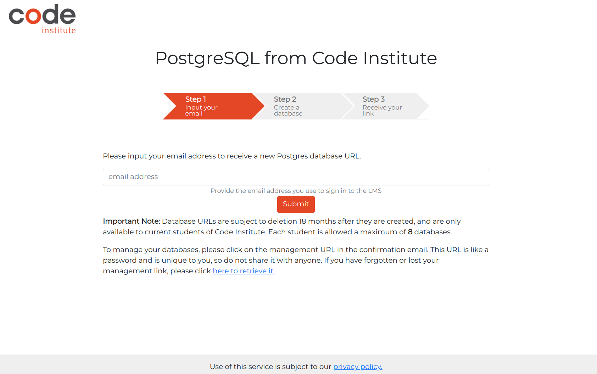

# AstroShare Blog

AstroShare Blog is a fictional blog posting news site where information on astronomically related topics can be discussed and verified users can blog posts. There are a number of categories to choose from. There is a comments section below each post. The idea is basically to create the ultimate space blog and discussion center for enthusiasts, experts and curious minds alike! Here users can post, read and comment on the latest news stories about space exploration, astronomy and much more. Each post is tagged by topic, making it easy to navigate through categories like 'Astronomy', 'Space Emissions', 'Astrophysics' and more. Posts can be voted up or down, with the most engaging content highlighted. Users can also leave comments on posts to join the conversation. Every post and comment is timestamped, which promotes real-time discussions and builds a vibrant, interactive community around space topics.

A live version of the project can be accessed here: [AstroShare Blog](https://astroshare-blog-6a7ca9d34749.herokuapp.com/)


# Table Of Contents
  - Introducton
    - [AstroShare Blog](#astroshare-blog)
  - [Development Tools](#development-tools)
  - [CSS Management for Project Structure](#css-management-for-project-structure)
  - [Technologies Used](#technologies-used)
    - [Wireframes](#wireframes)
  - [Colors](#colors)
    - [Color Customization Process](#color-customization-process)
  - [User-Friendly Approach](#user-friendly-approach)
    - [UX Table Of Contents](#the-ux-table-of-contents)
        1. [Welcome and Introduction](#1-welcome-and-introduction)
        2. [Frontpage of the Blogpost](#2-frontpage-of-the-blogpost)
        3. [Nav-bar](#3-nav-bar)
        4. [Sign-Up Process](#4-sign-up-process)
        5. [Creating and Sharing Content](#5-creating-and-sharing-content)
        6. [Interaction and Collaboration](#6-interaction-and-collaboration)
        7. [Profile and Community Building](#7-profile-and-community-building)
        8. [Ease of Use and Accessibility](#8-ease-of-use-and-accessibility)
        9. [Continuous Engagement](#9-continuous-engagement)
        10. [Conclusion](#10-conclusion)
    - [User Demographic Table of Contents](#user-demographic-table-of-contents)
        1. [Age Group](#1-age-group)
        2. [Interest](#2-interest)
        3. [Education Level](#3-education-level)
        4. [Technological Proficiency](#4-technological-proficiency)
        5. [Geographic Location](#5-geographic-location)
        6. [Behavioral Traits](#6-behavioral-traits)
        7. [Accessibility Needs](#7-accessibility-needs)
    - [User Stories and Epics](#user-stories-and-epics)
    - [Milestones](#milestones)
    - [The Structure Plane](#the-structure-plane)
  - [Testing](#testing)
    - [HTML Validation](#html-validation)
    - [CSS Validation](#css-validation)
    - [Accessibility](#accessibility)
    - [Wave Validation](#wave-validation) 
    - [Lighthouse Validation](#lighthouse-validation)
    - [JSHint Validation](#jshint-validation)
    - [Device Testing](#device-testing)
    - [Browser Compatibility](#browser-compatibility)
    - [PEP8](#pep8)
    - [Device Test](#device-testing)
    - [User Stories Testing](#user-story-testing)
  - [Deployment](#deployment)
  - [License](#license)
  - [Bugs & Chalelenges](#bugs--challenges)
  - [1Acknowled](#A)
  - [Credits](#credits)
  

## Development Tools

- **Bootstrap:** Bootstrap is a popular front-end development framework that helps developers create responsive, mobile-first websites quickly and efficiently. It provides a collection of pre-designed HTML, CSS, and JavaScript components like buttons, forms, navigation bars, and grid layouts. By using Bootstrap, developers can build modern, visually consistent web pages without writing extensive custom code. It's widely appreciated for its ease of use, customization options, and ability to adapt to various screen sizes, making it a go-to tool for fast web development.
- **Modular Design:** Modular design is a system design approach that divides a system into independent, interchangeable modules. Each module performs a specific function, enabling flexibility, easy maintenance, scalability, and reusability.
- **Consistent Aesthetic:** To maintaining a unified and cohesive visual style across all elements of a design. This includes consistent use of colors, fonts, shapes, and layout, ensuring that all components appear harmonious. It enhances user experience by creating familiarity and brand identity, making designs more professional and visually appealing.

[Back to Top](#astroshare-blog)

## Technologies Used

### 
-  **PostgreSQL:** The primary database used to store user data, blog post listings, article details, ... chosen for its flexibility and scalability.
### Frontend
-  **HTML:** The foundation for structuring the web pages, providing the semantic markup needed for the site's content.
-  **CSS:** Applied to style and layout the web pages, ensuring a consistent and visually appealing user interface across the application.
-  **JavaScript:** Employed to add interactivity and dynamic elements to the site, enhancing the user experience with features like form validation and asynchronous content updates.
-  **Bootstrap:** Integrated to utilize its responsive grid system and pre-built components, ensuring the site is mobile-friendly and adaptable to different screen sizes.

[Back to Top](#astroshare-blog)

## CSS Management for Project Structure

In my project, I decided to use a single CSS file, styles.css, to manage all the styling across the application.
These variables are defined within styles.css, and ensuring they work correctly is crucial for applying themes consistently across the site.

By consolidating all the styles into one file, I make managing themes straightforward. If I need to switch themes or make adjustments, I only need to modify this single CSS file, which allows for a seamless transition to a new look and feel across the entire application. This approach not only simplifies maintenance but also reinforces my focus on code reuse and consistency.

Additionally, having a single CSS file helps me avoid complications related to injecting styles through Bootstrap, ensuring that the CSS variables function as intended throughout the application.

[Back to Top](#astroshare-blog)

## Wireframes

The wireframes for this project served as a crucial guide during the development process, essentially acting as a blueprint for the design and layout of the website. My focus was primarily on two key pages: the index (or homepage) and the frontpage blog post. Given the repetitive nature of the blog post, I decided that it was a better idea to separate the homepage and the frontpage. The homepage serves more as an introductory page, while the frontpage blog post is a more active working page for the blog posts.

I chose to highlight only two wireframes in this README as they are the most critical to the overall user experience. Other pages did not require such detailed wireframing and followed more standard, basic templates.

#### Wireframes for Homepage & Frontpage

<details>
  <summary>Wireframe for Homepage Desktop</summary>
  
</details>
<br>
<details>
  <summary>Wireframe for Frontpage Blogpost Desktop</summary>
  
</details>
<br>
<details>
  <summary>Wireframe for Homepage Responsive</summary>
  
</details>
<br>
<details>
  <summary>Wireframe for Frontpage Blogpost Responsive</summary>  
  
</details>
<br>

[Back to Top](#astroshare-blog)

### Index Page Overview

The homepage starts with a 'hero section' featuring an embedded video stream in replay, along with a parallax effect designed to captivate visitors. This section offers users the option to engage with the Blog Post.

Following this, the AstroBlog section provides a brief introduction to the purpose of the site, helping visitors quickly understand what the site is about.

To build more interest, I have incorporated an 'Astronomy Picture of the Day' (APOD) section where users and visitors always have a new astronomical item to explore, providing an easy and quick overview of the latest posts.

In a zigzag pattern, the most popular categories are displayed on the homepage. To encourage further engagement with the blog, a "Latest Contributors" section is also included.

For astronomical enthusiasts, a nice widget is incorporated that tracks the current position of the International Space Station (ISS). When clicking on the 'Go To the ISS' button, a new page appears with an independently generated world map showing the ISS’s location.

At the bottom of the page, I have included a subscription section where users can join the mailing list to receive newsletters, information, and relevant benefits.

Finally, the page concludes with a footer that reinforces credibility and includes essential links, such as the social media links for the AstroBlog.

[Back to Top](#astroshare-blog)

### Front Page Overview
The **Front Page** is designed to give a quick overview of a list of 5 blog posts ranked by the date added, with the most recent post at the top of the page.

1. **NavBar**: The 'navbar' has a dual function and can be used by both visitors and authenticated users.
   - Visitors can quickly navigate back to the "homepage" by clicking the home icon or to the 'front page blog posts' by clicking the left arrow icon.
   - **For Visitors**: Visitors can always read posts but cannot participate. They have the option to view posts by category or to join Astro Blog by registering.
   - **For Users**: Users have full CRUD (Create, Read, Update, Delete) functionality for their own posts. The 'Add Post' option appears, and they see 'Logged in as,' giving them the ability to change their profile settings and details.

2. **Blog Post Snippets**: Each blog post is presented as a snippet along with a corresponding image.
   - **For Visitors**: The `[read more]` link redirects to the article detail page where the full post can be read.
   - **For Users**: Users have the same functionality as visitors, but on the redirected page, they have full control over their posts.

3. **Detailed Article Posts**: On this page, each post is treated individually.
   - **For Visitors**: Visitors can read the full blog post and any comments (if available). They cannot like or comment on posts. Visitors can click on the author's name to view the author’s profile page.
   - **For Users**: Users can read the post, comment, and 'Like' the posts. They can only 'Dislike' posts they have already liked.  
     The option to dislike posts outright is not part of the blog’s policy.

#### Mobile first design
To ensure a seamless experience across devices, Bootstrap is used to make the Home- & Frontpage fully responsive. On mobile devices, the table features horizontal scrolling to prevent content compression, maintaining clarity and usability. Additionally, each table row highlights with a colour change on hover, making it easier for users to track their interactions as they navigate.

[Back to Top](#astroshare-blog)

## Colors

The color palette for this project has been carefully selected to ensure a professional and clean aesthetic, aligning with the brand identity and enhancing user experience. Below is a breakdown of the primary colors used across the application:


- **Primary Color:** `#352F44` - Is a dark, muted purple with gray undertones, giving it a sophisticated, moody, and elegant feel. clarity and focus.
- 
- **Secondary Color:** `#5C5470` - (also atrribute color) Is a muted, medium-dark purple with gray undertones, offering a subtle and sophisticated appearance.
- 
- **Primary Color Highlight:** `#AD91FC` - Highlight color for hover effects, is a soft, pastel lavender with a light, calming appearance, often associated with a gentle, serene feel.
- 
- **Background Color:** `#B9B4C7` - is a soft, muted lavender-gray with cool undertones, giving it a calm and subtle appearance.
- 
- **Accent Color:** `#FAF0E06` - Is a soft, pale beige with warm undertones, often referred to as linen, giving it a light, neutral, and calming feel.
- 
- **Main Text Color:** `#FFFFFF` - Tis pure white, the brightest and most neutral color, representing simplicity, cleanliness, and clarity.
- 
- **Secondary Text Color:** `#000000` - (--main-text-color-invers) Is pure black, the darkest color, symbolizing elegance, power, and sophistication.
- 
- **Warning Color:** `#FF0000` - Is a bold, bright red, commonly associated with intensity, urgency, and passion.
- 
- **Dark Text Shadow:** `2px 2px 4px rgba(0, 0, 0, 0.5)` - A bolder text shadow used on white backgrounds, ensuring 
that text stands out clearly.
- 

This color palette was chosen not only for its visual appeal but also for its contribution to a cohesive and user-friendly interface, reinforcing the professional and serious tone of the application.

[Back to Top](#astroshare-blog)

### Color Customization Process

The colour customization process in this project was designed to offer flexibility and personalisation. I have implemented a series of **CSS Variables** to define various colour palettes.

Key elements of the colour customization process include:

- **Multiple Colour Palettes**: I have created several distinct colour palettes, each with its unique style—ranging from more traditional to modern and alternative designs. The default palette, known as the **root palette**, is the primary theme that all users see upon first visiting the site.

- **CSS Variables**: The different colour palettes are implemented using CSS Variables, which allows for dynamic and flexible styling of various elements across the site. This ensures a consistent and responsive design while providing a personalised experience for each user.

[Table Of Contents](#table-of-contents)

## The UX Table Of Contents
  1. [Welcome and Introduction](#1-welcome-and-introduction)
  2. [Frontpage of the Blogpost](#2-frontpage-of-the-blogpost)
  3. [Nav-bar](#3-nav-bar)
  4. [Sign-Up Process](#4-sign-up-process)
  5. [Creating and Sharing Content](#5-creating-and-sharing-content)
  6. [Interaction and Collaboration](#6-interaction-and-collaboration)
  7. [Profile and Community Building](#7-profile-and-community-building)
  8. [Ease of Use and Accessibility](#8-ease-of-use-and-accessibility)
  9. [Continuous Engagement](#9-continuous-engagement)
  10. [Conclusion](#10-conclusion)

### 1. Welcome and Introduction
**User opens the blog website:**

- **Landing Page:**
  - A visually appealing landing page with a background video of the night sky or a space theme.
  - A welcoming headline: "Share the latest space news - Welcome to Cosmic Chronicles, your gateway to the wonders of the universe!".
  - On the landing page there is no nav-bar but only "Go The Blog" button to navigate to the blogpost.
  - There extra features build in like a "Astronomy Picture of the Day"  whit a link to NASA APODs.
  - Subscribtion section for newsletter sign up.
  - A snap of the most popular categories of this blog.
  - The most recent contributors are displayed in the homepage.
  - A widget that tracks the International Space Station whit a redirect link that actual plot the ISS in real time on a map.

- **Call to Action:**
  - "Go To The Blog" button leads you the blogpost frontpage.
  - There are links where you interact whit API of "Astronomy Picture of the Day" and the International Space Station or ISS worldmap plotter.
  - Fill in the subscription and a confirmation mail will be sent.
  - Subscription is no registration to the blogpost.

### 2. Frontpage of the Blogpost
- **User clicks on "Go To The Blog":**
  - All registered users can add post on the blog.
  - All post listed at there post date and shows a short list of text.
  - On "Read more" hyperlinks there is redirect to blog post details where every aspect of the post can be read.

- **Call to Action:**
  - All non-autheticad users can access the blog post, but can not add posts.
  - All autheticad users can add posts, they can also delete or edit there posts.
  - Pagination to easy access other blog post.

[Table Of Contents](#table-of-contents)

### 3. Nav-bar 
- **User clicks access to Navigation Bar"**
  - The users can see any time login status in right upper corner.
  - The users can access if logged in there creditials.
  - The users can easy search trougout the blogpost.
  - Categories lists feature to display post per category.
  - Content of the categories.
  - Arrow icon left redirect always the blogpost frontpage.
  - House icon redirect always to the landing page.

- **Call to Action**
  - The users can easy login or logout.
  - The users can update and/or manipulate there profile.    
  - The users can search for certain key words to access and find posts.
  - Display all posts relevant to the category.
  - Show all categories and there content in Blog Post Categories.
  - Subpage of the blogpost is the frontpage of the blogpost.
  - Mainpage of the blogpost is the homepage of the blogpost.

### 4. Sign-Up Process
**User clicks on "Sign Up":**

- **Sign-Up Form:**
  - On the blog frontpage there is on the right upper corner a "Register" button.
  - Simple form requesting essential information: Username, Email, Password, and Confirm Password.
  - Optional feature is to sign up using social media accounts (Google, Facebook). 

- **Profile Setup:**
  - After signing up, there is the possibility to complete their profile "Create Profile Page" button:
    - Write a short bio.
    - Upload a profile picture.      
    - Add links to personal websites or social media profiles (optional).
  - If needed the user can always update there profile afterwards.

### 5. Creating and Sharing Content
**User clicks on "Add Post":**

- **Add Post Page:**
  - Simple and intuitive editor for creating posts:
    - Title field.
    - Content field with rich text formatting options.
    - Option to add photos (drag and drop or upload from device).
    - Tags field for categorizing the post (e.g., Planets, Stars, Telescopes, Space Missions).
  - "Post" button to publish the content.

[Table Of Contents](#table-of-contents)

### 6. Interaction and Collaboration
**User interacts with a post:**

- **Commenting:**
  - Users can leave comments on posts.
  - Comment section with a clear text field, and an "Add Comment" button.
  - Ability to reply to comments and like/dislike comments.

- **Collaborative Features:**
  - Option to invite other users to collaborate on a post.
  - Real-time collaboration with a shared editor for multiple contributors.

### 7. Profile and Community Building
**User explores their profile and connects with others:**

- **User Profile:**
  - Profile page displaying user information: profile picture, bio, posts, and activity.
  - Edit Profile button for updating information and settings.

- **Community Engagement:**
  - Explore page with user search functionality.
  - Follow other users on their posts and activities.
  - Direct messaging feature for private conversations.

[Table Of Contents](#table-of-contents)

### 8. Ease of Use and Accessibility
**User enjoys a seamless experience:**

- **Responsive Design:**
  - Blog is fully responsive and works seamlessly on desktop, tablet, and mobile devices.
  - Fast loading times and smooth transitions between pages.

- **Accessibility:**
  - High contrast mode and text resizing options for visually impaired users.
  - Keyboard navigable interface and screen reader compatibility.

### 9. Continuous Engagement
**User stays engaged and returns to the blog:**

- **Content Recommendations:**
  - Personalized content recommendations based on user’s interests and activity.
  - Regular email updates with highlights from the blog and upcoming astronomical events.

- **Events and Challenges:**
  - Community events such as virtual star-gazing sessions, photo contests, and Q&A sessions with astronomy experts.
  - Interactive challenges and quizzes to keep users engaged and learning.

### 10. Conclusion
AstroShare offers a user-friendly, engaging, and collaborative platform for astronomy enthusiasts to share knowledge, interact with the community, and enjoy a seamless and enriching experience.

[Table Of Contents](#table-of-contents)

## User Demographic Table of Contents
1. [Age Group](#1-age-group)
2. [Interest](#2-interest)
3. [Education Level](#3-education-level)
4. [Technological Proficiency](#4-technological-proficiency)
5. [Geographic Location](#5-geographic-location)
6. [Behavioral Traits](#6-behavioral-traits)
7. [Accessibility Needs](#7-accessibility-needs)

### 1. Age Group
- Primarily adults and young adults (18-65 years old) who have a keen interest in astronomy and space exploration.
- This demographic is likely to be tech-savvy and comfortable using digital platforms for both learning and social interaction.

### 2. Interest
- Individuals who are passionate about astronomy, including amateur astronomers, space enthusiasts, students studying astronomy or related sciences, and professionals working in the field.

### 3. Education Level
- Varied, but likely to include individuals with at least a high school education and a strong interest in science, particularly astronomy and space sciences.
- Some users may have advanced degrees or be pursuing careers in astronomy or related fields.

### 4. Technological Proficiency
- Users who are comfortable with technology, including social media platforms, online communities, and content creation tools.
- They are likely to engage actively in online discussions, share content, and collaborate with others on the platform.

### 5. Geographic Location
- The platform may attract users globally, given the universal interest in astronomy.
- However, regions with active amateur astronomy communities, space research institutes, or strong educational programs in astronomy may have a higher concentration of users.

### 6. Behavioral Traits
- Users who enjoy sharing knowledge, participating in discussions, and engaging with multimedia content such as photos and videos related to astronomy.
- They may also value community building, collaborative projects, and staying updated with the latest astronomical discoveries and events.

### 7. Accessibility Needs
- While primarily targeting users comfortable with digital platforms, efforts should be made to ensure accessibility features such as high contrast mode, text resizing, and screen reader compatibility to accommodate users with visual impairments or disabilities.

[Back to User Demographic Table of Contents](#user-demographic-table-of-contents)

## User Stories and Epics
Astro Blog Share is for those who are interested in Astronomical subjects and like to share there toughs in a deticated blog. The blog can be used as a discussion platform for anybody who have a special affliation whit astronomy.

A user story is an explanation of a software feature written from the perspective of the end user. Its purpose is to articulate how a software feature will provide value to the customer. User stories were created with the help of GitHub issues. Each user story contains:
* Title - Short description of the user story. 
* Description - As a **role** i can **capability** so that **received benefit**.
* Acceptance criteria - A set of conditions that a feature must meet to be accepted by the user. 
* Unit tasks - A break down of each task needed to complete user story. 
* A MoSCoW label - To prioritise tasks. 
* Assignee -  Who the user store is assigned too. 
* Milestone - Which epic this user store is associated with.
<br/>


I used an Agile methodology approach to plan this project. This was implemented through the GitHub Project board with milestones, epics, user stories and tasks.
Each user story was classified with a label according to MoSCoW prioritization.<br>
The Kanban board can be seen [here](https://github.com/users/Harmonica-Men/projects/10).

### Milestones

The project was divided into three milestones, each containing the corresponding epics and user stories:<br>
1. [Setting Up The Project @ Bear minimums](https://github.com/Harmonica-Men/AstroShare-Blog/milestone/1)
- Task: Set up the project repository and initialize Django project.
- Create a new repository on GitHub, GitPod.
- Set up the virtual environment and install Django.
- Initialize a new Django project and create a base application.
- Configure settings for the project  static files, static and README.md 
- Deploy early to a hosting platform Heroku

2. [Basic Blog Functionality](https://github.com/Harmonica-Men/AstroShare-Blog/milestone/2)
- Task: Implement basic blog functionality including models, views, and templates.
  - Define the models for blog posts (e.g., Post, Category, Tag).
  - Create views to list all posts, view individual posts, and manage categories/tags.
  - Design templates for the blog homepage, individual post pages, and category/tag pages.
  - Implement URL routing for the blog.

3. [User Authentication](]https://github.com/Harmonica-Men/AstroShare-Blog/issues/8)
- Task: Add user authentication to allow for author logins and secure post management.
  - Set up Django’s built-in authentication system.
  - Create registration, login, and logout views and templates.
  - Implement user-specific actions, such as creating, editing, and deleting blog posts.

4. [Admin Interface](https://github.com/Harmonica-Men/AstroShare-Blog/issues/9)
- Task: Set up the Django admin interface for managing blog content.
  - Register blog models with the Django admin.
  - Customize the admin interface for better usability (e.g., list displays, search fields).

5. [Commenting System](https://github.com/Harmonica-Men/AstroShare-Blog/issues/10)
- Task: Implement a commenting system for blog posts.
  - Create models for comments linked to blog posts.
  - Create views and templates for adding and displaying comments.
  - Implement moderation features for comments (e.g., approval workflow).

6. [Styling and Frontend](https://github.com/Harmonica-Men/AstroShare-Blog/issues/11)
- Task: Apply CSS and JavaScript to enhance the look and feel of the blog.
  - Use a CSS framework like Bootstrap for basic styling.
  - Customize templates to ensure a consistent and responsive design.
  - Add JavaScript for interactive elements (e.g., comment submission, post likes).

7. [Search and Filtering](https://github.com/Harmonica-Men/AstroShare-Blog/issues/12)
- Task: Implement search and filtering capabilities.
  - Add a search bar to allow users to search for posts.
  - Implement filtering by categories, tags, and publication dates.
  - Optimize search and filter queries for performance.

8. [SEO and Performance Optimization](https://github.com/Harmonica-Men/AstroShare-Blog/issues/13)
- Task: Optimize the blog for search engines and improve performance.
  - Implement SEO best practices (e.g., meta tags, sitemap, robots.txt).
  - Optimize images and static files for faster loading.
  - Use caching to improve page load times.

9. [Testing and Deployment](https://github.com/Harmonica-Men/AstroShare-Blog/issues/14)
- Task: Write tests and deploy the project.
  - Write unit tests and integration tests for critical functionality.
  - Set up continuous integration (CI) to automate - and/or manual testing

## User stories 

A user story is an explanation of a software feature written from the perspective of the end user. Its purpose is to articulate how a software feature will provide value to the customer. User stories were created with the help of GitHub issues. Each user story contains:
* Title - Short description of the user story. 
* Description - As a **role** i can **capability** so that **received benefit**.
* Acceptance criteria - A set of conditions that a feature must meet to be accepted by the user. 
* Unit tasks - A break down of each task needed to complete user story. 
* A MoSCoW label - To prioritise tasks. 
* Assignee -  Who the user store is assigned too. 
* Milestone - Which epic this user store is associated with.

Below is an example of how the user stories where structured for this project.

<br>

List of Epics: <br>

- [EPIC 1: Repository and Deploy Early](https://github.com/users/Harmonica-Men/projects/10?pane=issue&itemId=70098431)
- [EPIC 2: Basic Blog Functionality](https://github.com/users/Harmonica-Men/projects/10/views/1?filterQuery=label%3AEPICS&pane=issue&itemId=70117569)
- [EPIC 3: User authentication](https://github.com/users/Harmonica-Men/projects/10/views/1?filterQuery=label%3AEPICS&pane=issue&itemId=70121138)
- [EPIC 4: Admin Interface](https://github.com/users/Harmonica-Men/projects/10/views/1?filterQuery=label%3AEPICS&pane=issue&itemId=70123718)
- [EPIC 5: Commenting System](https://github.com/users/Harmonica-Men/projects/10/views/1?filterQuery=label%3AEPICS&pane=issue&itemId=70128247)
- [EPIC 6: Styling and Frontend](https://github.com/users/Harmonica-Men/projects/10/views/1?filterQuery=label%3AEPICS&pane=issue&itemId=70208718)
- [EPIC 7: Search and Filtering](https://github.com/users/Harmonica-Men/projects/10/views/1?filterQuery=label%3AEPICS&pane=issue&itemId=70129504)
- [EPIC 8: SEO and Performance Optimization](https://github.com/users/Harmonica-Men/projects/10/views/1?filterQuery=label%3AEPICS&pane=issue&itemId=70129811)
- [EPIC 9: Testing and Validations](https://github.com/users/Harmonica-Men/projects/10/views/1?filterQuery=label%3AEPICS&pane=issue&itemId=70130186)

User Stories with their id:  <br>
- As a software developer,I can to set up the VS Code IDE on my local machine,so that I can efficiently develop and debug my projects. [#37](https://github.com/users/Harmonica-Men/projects/10/views/1?pane=issue&itemId=70364129)
- As a software developer, I want to set up a GitHub repository for our new project, so that the team can collaborate on the codebase efficiently and maintain version control. [#2](https://github.com/users/Harmonica-Men/projects/10/views/1?pane=issue&itemId=70098555)
- As a software developer, I can to create a working Django app, so that I can build and deploy a web application efficiently. [#3](https://github.com/users/Harmonica-Men/projects/10?pane=issue&itemId=70105394)
- As a software developer, I want to deploy our application to Heroku, so that it is accessible to users and can be tested in a live environment. [#4](https://github.com/users/Harmonica-Men/projects/10/views/1?pane=issue&itemId=70105449)
- As a software developer, I want to set up a GitHub repository for our new project, so that the team can collaborate on the codebase efficiently and maintain version control.[#5](https://github.com/users/Harmonica-Men/projects/10/views/1?pane=issue&itemId=70109025)
- As a software developer, I want to define the models for blog posts, so that the application can store and manage blog post data efficiently.[#15](https://github.com/users/Harmonica-Men/projects/10/views/1?pane=issue&itemId=70132743)
- As a software developer, I can to create views to list all posts, view individual posts, and manage categories and profiles, so that users can easily navigate and interact with the blog content and manage their profiles.[#16](https://github.com/users/Harmonica-Men/projects/10/views/1?pane=issue&itemId=70135804)
- As a software developer, I can to design templates for the blog, so that the blog has a consistent and visually appealing layout.[#17](https://github.com/users/Harmonica-Men/projects/10/views/1?pane=issue&itemId=70138078)
- As a software developer, I can to implement URL routing for the blog, so that users can navigate to different parts of the blog application.[#18](https://github.com/users/Harmonica-Men/projects/10/views/1?pane=issue&itemId=70139779)
- As a frontend developer, I want to set up Django’s built-in authentication system, so that users can securely register, log in, and manage their accounts.[#19](https://github.com/users/Harmonica-Men/projects/10/views/1?pane=issue&itemId=70201797)
- As a software developer, I can to create registration, login, and logout views and templates, so that users can securely register, log in, and log out of the application.[#20](https://github.com/users/Harmonica-Men/projects/10/views/1?pane=issue&itemId=70203518)
- As a software developer, I can to implement user-specific actions for creating, editing, and deleting blog posts,
so that users can manage their own blog content.[#21](https://github.com/users/Harmonica-Men/projects/10/views/1?pane=issue&itemId=70204403)
- As a software developer, I want to register the blog models with the Django admin, so that I can manage blog content through the Django admin interface.[#22](https://github.com/users/Harmonica-Men/projects/10/views/1?pane=issue&itemId=70205152)
- As an admin user, I can to customize the admin interface to improve usability, so that I can efficiently manage data and perform administrative tasks.[#23](https://github.com/users/Harmonica-Men/projects/10/views/1?pane=issue&itemId=70205593)
- As a software developer, I can to create models for comments linked to blog posts, so that users can add comments to blog posts and manage them efficiently.[#24](https://github.com/users/Harmonica-Men/projects/10/views/2?pane=issue&itemId=70206168)
- As a user, I can to add comments to blog posts and view comments on blog posts, so that I can engage with the content and other users.[#25](https://github.com/users/Harmonica-Men/projects/10/views/2?pane=issue&itemId=70206850)
- As a software developer, I can to implement moderation features for comments, so that comments can be reviewed and approved before being displayed publicly.[#26](https://github.com/users/Harmonica-Men/projects/10/views/1?pane=issue&itemId=70207750)
- As a software developer, I want to use a CSS framework like Bootstrap for basic styling, so that the application has a consistent and responsive design with minimal effort.[#28](https://github.com/users/Harmonica-Men/projects/10/views/1?pane=issue&itemId=70210752)
- As a user, I can to customize templates so that I can ensure a consistent and responsive design across all devices and platforms.[#29](https://github.com/users/Harmonica-Men/projects/10/views/1?pane=issue&itemId=70211351)
- As a software developer, I want to add JavaScript for interactive elements such as comment submission and post likes, so that users can interact with the blog posts dynamically without page reloads.[#30](https://github.com/users/Harmonica-Men/projects/10/views/2?pane=issue&itemId=70211925)
- As a user, I can to have a search bar on the blog, so that I can easily search for posts by keywords.[#31](https://github.com/users/Harmonica-Men/projects/10/views/2?pane=issue&itemId=70212442)
- As a user, I can to filter blog posts by categories, tags, and publication dates, so that I can easily find the content that interests me.[#32](https://github.com/users/Harmonica-Men/projects/10/views/2?pane=issue&itemId=70212964)
- As a software developer, I can to implement SEO best practices, so that the application ranks higher in search engine results and attracts more organic traffic.[#34](https://github.com/users/Harmonica-Men/projects/10/views/2?pane=issue&itemId=70213733)
- As a front-end developer, I want to optimize images and static files, so that the application loads faster and provides a better user experience.[#35](https://github.com/users/Harmonica-Men/projects/10/views/2?pane=issue&itemId=70214000)
- As a software developer, I want to write unit tests and integration tests for critical functionality, So that I can ensure the reliability and correctness of the application and catch issues early in the development cycle. [#38](https://github.com/users/Harmonica-Men/projects/10/views/1?pane=issue&itemId=79390026) 
- As a software developer, I want to set up continuous integration (CI), So that I can automate tests and streamline manual testing processes to improve software quality and reduce the time spent on manual checks. [#39](https://github.com/users/Harmonica-Men/projects/10/views/1?pane=issue&itemId=79390026)
- As a software developer, I want to set up continuous integration (CI), So that I can automate tests and streamline manual testing processes to improve software quality and reduce the time spent on manual checks. 

## User Stories Table of Contents
1. [Welcome and Introduction](#welcome-and-introduction)
2. [Sign-Up Process](#sign-up-process)
3. [Navigation and Exploration](#navigation-and-exploration)
4. [Creating and Sharing Content](#creating-and-sharing-content)
5. [Interaction and Collaboration](#interaction-and-collaboration)
6. [Profile and Community Building](#profile-and-community-building)
7. [Ease of Use and Accessibility](#ease-of-use-and-accessibility)
8. [Continuous Engagement](#continuous-engagement)

## Welcome and Introduction
**As a user:**
- I want to see a visually appealing landing page with a space theme and a welcoming headline.
- I want to read a brief introduction about the community and its features.
- I want to have prominent "Sign Up" and "Log In" buttons to easily join or access the blog.
- I want to watch a short introductory video or animation showcasing the blog's features.

## Sign-Up Process
**As a user:**
- I want to click on "Sign Up" and fill out a simple form with my Username, Email, Password, and Confirm Password.
- I want to have the option to sign up using my social media accounts (Google, Facebook).
- I want to be prompted to complete my profile by uploading a profile picture, writing a short bio, and optionally adding links to personal websites or social media profiles after signing up.

[Back to User Stories Table of Contents](#user-stories-table-of-contents)

## Navigation and Exploration
**As a user:**
- I want to be directed to the main dashboard with a personalized greeting after completing the sign-up.
- I want an easy-to-navigate menu with options like Home, Explore, Create Post, My Profile, Notifications, Settings, and Log Out.
- I want to see a home feed with the latest posts from users, including photos, articles, and discussions about various astronomical topics.
- I want each post to include the author’s profile picture, name, post title, content preview, and interaction buttons (Like, Comment, Share).

# Database
  PostgreSQL uitleg psycopg2  (pip install) 2.9.6
  Cloudinary werking generate new API-key ... (pip install)

## Creating and Sharing Content
**As a user:**
- I want to click on "Create Post" and access a simple and intuitive editor.
- I want to have a title field, content field with rich text formatting options, and the ability to add photos either by dragging and dropping or uploading from my device.
- I want to add tags to categorize my post and a "Post" button to publish my content.

[Back to User Stories Table of Contents](#user-stories-table-of-contents)

[Back to Top](#astroshare-blog)

## Flowchart

This flowchart was created to determine the flow of the website. It shows which pages are available to the user. It takes into account if the user is logged in to the website or not.


## Entity Relationship Diagram

The database design for this project includes Four tables. The first table is a review table. This table houses all the data associated with making a review on the site. There is a customer table, which houses the details of the customer and this is linked to a booking table via a foreign key relationship. The booking table contains the information needed in order for users to make a booking. The last table present is the user table. This table has the information necessary for users to have an account on the website and has a foreign key relationship with the customer table.


## Interaction and Collaboration
**As a user:**
- I want to leave comments on posts with a clear text field and an "Add Comment" button.
- I want to be able to reply to comments and like or dislike them.
- I want to invite other users to collaborate on a post.
- I want real-time collaboration with a shared editor for multiple contributors.
- I want to receive notifications for new comments, likes, and collaboration invites, with a notification bell icon in the menu bar showing a dropdown list of recent notifications.

[Back to User Stories Table of Contents](#user-stories-table-of-contents)

## Profile and Community Building
**As a user:**
- I want to explore my profile page that displays my information, including my profile picture, bio, posts, and activity.
- I want an "Edit Profile" button to update my information and settings.
- I want to use the Explore page to search for other users.
- I want to follow other users to receive updates on their posts and activities.
- I want to use a direct messaging feature for private conversations.

## Ease of Use and Accessibility
**As a user:**
- I want the blog to be fully responsive and work seamlessly on desktop, tablet, and mobile devices.
- I want fast loading times and smooth transitions between pages.
- I want high contrast mode and text resizing options for better accessibility if I am visually impaired.
- I want a keyboard navigable interface and screen reader compatibility.
- I want an easily accessible help section with FAQs and tutorials, along with a contact support option for direct assistance.

## Continuous Engagement
**As a user:**
- I want personalized content recommendations based on my interests and activity.
- I want regular email updates with highlights from the blog and information about upcoming astronomical events.
- I want to participate in community events such as virtual star-gazing sessions, photo contests, and Q&A sessions with astronomy experts.
- I want to engage in interactive challenges and quizzes to keep learning and stay engaged with the blog.

[Back to User Stories Table of Contents](#user-stories-table-of-contents)

[Back to Top](#astroshare-blog)

## Testing

### HTML Validation

All pages have been passed through the [W3C HTML Validator](https://validator.w3.org/) successfully save for a few minor issues which have been left 'as is' as attempts to correct them proved unsuccessful and lead to results which devalued the user experience. Specifically, these were:

I ensured that the HTML structure of AstroBlog adheres strictly to web standards. I utilized the W3C Validator to validate our HTML code, striving to minimize and eliminate all possible errors. There are many templates to consider but the main pages where is the focus of stite are the Homepage and the Frontpaga-Blogpost.
After experimenting whit different container layout and fixing all the issues validation results showed **zero errors**.

The detail of these test can evaluate on this link.
<details>
  <summary>Click to view HTML Validation Homepage Result</summary>
  
  <br>

  <br>
  

</details>

---

### CSS Validation

<p>
    <a href="https://jigsaw.w3.org/css-validator/check/referer">
        
    </a>
</p>

The CSS of AstroBlog has been carefully crafted and validated to ensure it adheres to the highest standards. I utilized the W3C CSS Validator to check for any errors, and I'm pleased to report that our stylesheets passed with **zero errors**.

This thorough validation process ensures that the user interface is both visually appealing and fully compliant with modern web standards. We took particular care to validate our responsive design elements to ensure consistency across all devices.

Here’s the validation result:

<details>
  <summary>Click to view CSS Validation Result</summary>
  
</details>

---

### Accessibility

Ensuring accessibility is a key priority for AstroBlog. We've taken great care to make sure our platform is inclusive and usable by as many people as possible, regardless of their abilities or the devices they are using.

Throughout the development process, we adhered to the Web Content Accessibility Guidelines (WCAG) to guarantee that our site meets accessibility standards. This includes:

- **Proper use of ARIA attributes:** We have utilized ARIA attributes effectively to enhance the accessibility of dynamic content and interactive elements, ensuring screen readers can accurately convey the information to users.
- **Keyboard Navigation:** All interactive elements, including forms, buttons, and navigation links, are fully accessible via keyboard navigation, making the site usable without a mouse.
- **Contrast Ratios:** We carefully selected our color scheme to ensure sufficient contrast between text and background colors, making the content readable for users with visual impairments.
- **Alt Text for Images:** All images include descriptive `alt` attributes, providing context to users who rely on screen readers.

These efforts help ensure that our site is not only compliant with accessibility standards but also provides an inclusive user experience. We continue to monitor and improve the accessibility of astroblog as we develop new features and enhancements.

---

### Wave Validation

I have conducted a thorough accessibility audit using the WAVE (Web Accessibility Evaluation Tool). There is a smooth transition between the header of the page and the rest of the main page. Nevertheless, there are some issues to address due to the background MPEG replay. WAVE is dynamic and cannot make a persistent measurement of background contrast.


I have also identified contrast issues with the modal buttons, which follow a similar color pattern to the Flash Danger alerts. However, the inclusion of shadow effects and other design enhancements significantly aids visibility. I believe these design choices ensure the buttons remain accessible and visually clear, even if they do not fully meet WAVE’s contrast recommendations.


<br>

Additionally, contrast warnings were noted in the Flash messages—interestingly, all colors except yellow were flagged. While we understand that white text on a transparent background might pose a readability challenge, WAVE does flaged it as an issue. Conversely, other colors, which do not seem problematic to us, were marked for contrast errors.


<br>

Overall, the WAVE validation confirms that our website adheres to accessibility standards, with only a few minor contrast issues that have been carefully considered in the design process. While we will continue exploring potential solutions to these issues, we have prioritized maintaining a visually cohesive and intuitive theme for the site.

Note: I'm fully aware of the contrast issues highlighted by the WAVE Validation Tool. It is my duty to address these in future updates to ensure an even higher level of accessibility across the entire platform. We appreciate the insights provided by the tool and will use this feedback to guide our ongoing improvements.

---

### Lighthouse Validation

My Lighthouse validation results have been very promising, with high scores across most categories. One area where I noticed a slightly lower score is in SEO, and I’m actively working on improvements to achieve even better results. Lighthouse has been instrumental in helping me organize my files and optimize for performance.

<details>
  <br>
  <summary>Click to view Lighthouse Homepage Result</summary>
  
  <br>
</details>

Test for Frontpage Blogpost

<details>
  <br>
  <summary>Click to view Lighthouse Frontpage Result</summary>
  
  <br>
</details>

A specific recommendation from Lighthouse was to use the WebP format for images to improve load times. In response, I made sure that all images served through the browser are now in WebP format. However, I also understand that too much compression could negatively impact the user experience, especially on larger screens. So, I made a conscious decision to balance performance with visual quality. After gathering feedback from a diverse group of users, I confirmed that the image quality is well-received across various devices. As a result, I decided to maintain slightly larger image sizes to prioritize a smooth and visually appealing experience, even if it means sacrificing a little bit of performance.

Additionally, Lighthouse suggested reducing the CSS payload, which I’m currently considering. One option I’m exploring is breaking the main styles.css file into smaller files tied to specific widgets. This would allow me to send only the necessary CSS for each page, potentially cutting down the overall size of the CSS file and improving load times.

While the desktop version scores are very high, the mobile version, although still passing, has some room for improvement. I’m committed to refining these areas to ensure the best possible experience across all devices.

---

### JSHint Validation

Although our project doesn't include an extensive amount of JavaScript, we have ensured that the code we do have is fully validated using **JSHint**. We are pleased to report that our JavaScript code has passed the validation process with a 100% clean bill of health—no errors whatsoever.

In addition to being error-free, the JavaScript code is thoroughly commented and documented. This will make it easier for future developers to understand the purpose and function of each part of the code.

---

### PEP8
All Python files as well env.py and manage.py, have been passed through the [Code Institute PEP8 Linter](https://pep8ci.herokuapp.com/). The only warnings given were for the settings.py file which contains a small number of long lines (i.e. greater than 80 characters) under AUTH_PASSWORD_VALIDATORS; as this is code implemented by Django itself at setup, these lines will be left unchanged. 

---

### Device Testing

The website has undergone thorough testing across a variety of devices, including desktop computers, tablets, and smartphones. We focused on ensuring that the responsiveness of the site is consistent and effective across all screen sizes, providing an optimal user experience regardless of the device used.

To achieve this, we employed media queries to adapt the layout for different screen sizes. This approach ensures that when the device's dimensions fall within specific ranges, certain elements will reposition themselves, maintaining readability and proper alignment. 

For instance, on smaller screens, such as smartphones, we adjusted the distribution of content to ensure that all elements are easily accessible and clearly visible, avoiding any overlap or readability issues. The result is a fluid and intuitive experience across devices, meeting our goal of a responsive design that performs well on all tested platforms.

--- 

### Browser Compatibility

We have conducted extensive testing to ensure that the website is fully compatible across a range of web browsers. Specifically, the site has been tested on:

-  **Google Chrome**
-  **Microsoft Edge**
-  **Opera**
-  **Mozilla Firefox**
-  **Safari**


In each browser, the website performs smoothly, maintaining consistent functionality and appearance. We focused on ensuring that all features, from user registration to job application processes, operate seamlessly regardless of the browser used.

No significant issues were encountered during the tests, confirming that our site is accessible and reliable across these popular browsers. This ensures that users can interact with the platform without any unexpected disruptions, regardless of their preferred browser.

---

[Back to Top](#astroshare-blog)

## User Story Testing

<details>
Navbar


| Homepage – Template                                                    |                                                               |                                     |       |
| ---------------------------------------------------------------------- | ------------------------------------------------------------- | ----------------------------------- | ----- |
| Scenario                                                               | Action                                                        | Result                              | Check |
| Click the “Go To Blog” Button                                          | should navigate to Frontpage - Blogpost                       | Redirect to Blog                    | PASS  |
| Click “Subscribe”                                                      | Should navigate to Subscription                               | Redirect to section bottom homepage | PASS  |
| Click “Go to APOD”                                                     | Should navigate to Astronomy Picture of the Day               | Redirect to APOD page               | PASS  |
| Click “Go to ISS”                                                      | Should navigate to Track the International Space Station page | Redirect to ISS page                | PASS  |
| Fill in “Subscribe to our Newsletter”Fill in Name & Email after Submit | Should navigate to Check Email Page                           | Redirect to “Check your Email” page | PASS  |


| Frontpage – blogpost Template               |                                                                     |                                                               |       |
| ------------------------------------------- | ------------------------------------------------------------------- | ------------------------------------------------------------- | ----- |
| NavBar – if user is logged out (visitors)   |                                                                     |                                                               |       |
| Scenario                                    | Action                                                              | Result                                                        | Check |
| Click House Icon                            | Should navigate to “Homepage”                                       | Redirect to Homepage                                          | PASS  |
| Click Arrow Left                            | Should navigate to “Frontpage – Blogpost”                           | Redirect to Frontpage                                         | PASS  |
| Click Category List                         | Dropdown menu to filter specific blogpost categories                | Redirect to Posts per Categorie                               | PASS  |
| Click Category List – Blog Posts Categories | Dropdown menu to shows all aviable categories and there discription | Redirect to Category List Page                                | PASS  |
| Click Search Query                          | Search for specific key words in the Blogpost                       | Redirect to Search post list out of blogpost specific keyword | PASS  |
| Click Register                              | Should navigate to Register page                                    | Redirect to Register page                                     | PASS  |
| Click Login                                 | Should navigate to Login page                                       | Redirect to Login Page                                        | PASS  |


| Navbar – If first time user is Logged In (registered users) |                                        |                                  |       |
| ----------------------------------------------------------- | -------------------------------------- | -------------------------------- | ----- |
| Scenario                                                    | Action                                 | Result                           | Check |
| Click Logged is as: [user]                                  | Should navigate to Create Profile Page | Redirect to Create Profile Page  | PASS  |
| Click Add Post                                              | Should navigate to Add Post            | Redirect to Create Add Post Page | PASS  |


| NavBar – if after create a profile |                                      |                               |       |
| ---------------------------------- | ------------------------------------ | ----------------------------- | ----- |
| Scenario                           | Action                               | Result                        | Check |
| Click Logged is as: [user]         | Should navigate to Edit Profile Page | Redirect to Edit Profile Page | PASS  |


| Frontpage – Blogpost If [user] Not Logged In (Visitors) |                                             |                                  |       |
| ------------------------------------------------------- | ------------------------------------------- | -------------------------------- | ----- |
| Scenario                                                | Action                                      | Result                           | Check |
| Click [Read More]                                       | Should navigate to Article Detail Page      | Redirect to Article Details Page | PASS  |
| Click [Pagination buttons]                              | Should navigate to other Frontpage Blogpost | Redirect to Frontpage Blogpost   | PASS  |
| Back to Top                                             | Should navigate to top of Frontpage         | Redirect to Top op Frontpage     | PASS  |


| Frontpage – Blogpost If [user] Logged In (Users)     |                                          |                                   |       |
| ---------------------------------------------------- | ---------------------------------------- | --------------------------------- | ----- |
| Scenario                                             | Action                                   | Result                            | Check |
| Click “Edit” for which to user has create the post   | Should navigate to Edit Article Blogpost | Redirect to Edit Article Blogpost | PASS  |
| Click “Delete” for which to user has create the post | Should navigate to Delete Blogpost       | Redirect Delete to Blogpost       | PASS  |

| Addpost page Template |                                       |                                |       |
| --------------------- | ------------------------------------- | ------------------------------ | ----- |
| Scenario              | Action                                | Result                         | Check |
| Post                  | Should navigate to Add new post       | Redirect to Add Newpost        | PASS  |
| Back to Blog          | Should navigate to Frontpage Blogpost | Redirect to Frontpage Blogpost | PASS  |


| Article detail blog post              |                                        |                                |       |
| ------------------------------------- | -------------------------------------- | ------------------------------ | ----- |
| Scenario                              | Action                                 | Result                         | Check |
| Click high lighted author name        | Should navigate to Author Profile Page | Redirect to Profile Page       | PASS  |
| Click Like (visitors)                 | must be logged in to comment           | no redirect to comments        | PASS  |
| Click Like (only autheticated users)  | Like button availeble                  | increase counter total likes   | PASS  |
| Click unlike                          | Unlike button availeble                | decrease counter total likes   | PASS  |
| Add Comment (vistors)                 | not able to make a comment             | no redirect to comments        | PASS  |
| Add Comment (only autheticated users) | Should navigate to Add Comments        | Redirect to Add Comments       | PASS  |
| Back to Blog                          | Should navigate to Frontpage Blogpost  | Redirect to Frontpage Blogpost | PASS  |

| Add comment Template |                                       |                                |       |
| -------------------- | ------------------------------------- | ------------------------------ | ----- |
| Scenario             | Action                                | Re-Action                      | Check |
| Cick Add Comment     | Should navigate to Add Comment        | Redirect to Add Comment        | PASS  |
| Back to Blog         | Should navigate to Frontpage Blogpost | Redirect to Frontpage Blogpost | PASS  |

| Login Template |                                     |                                |       |
| -------------- | ----------------------------------- | ------------------------------ | ----- |
| Scenario       | Action                              | Result                         | Check |
| Click Login    | After Filled in correct credintials | Redirect to Frontpage Blogpost | PASS  |

| Register Template |                          |                   |       |
| ----------------- | ------------------------ | ----------------- | ----- |
| Scenario          | Action                   | Result            | Check |
| Click on Register | Should navigate to Login | Redirect to Login | PASS  |

| Author Profile Template |                                       |                                |       |
| ----------------------- | ------------------------------------- | ------------------------------ | ----- |
| Scenario                | Action                                | Result                         | Check |
| Click Twitter icon      | Should navigate to Twitter            | Redirect to Twitter            | PASS  |
| Click Instagram icon    | Should navigate to Instagram          | Redirect to Instagram          | PASS  |
| Click Facebook          | Should navigate to Facebook           | Redirect to Facebook           | PASS  |
| Click Globe             | Should navigate to Website            | Redirect to Codeinstiture      | PASS  |
| Back to Blog            | Should navigate to Frontpage Blogpost | Redirect to Frontpage Blogpost | PASS  |

| Search Template |                                       |                                |       |
| --------------- | ------------------------------------- | ------------------------------ | ----- |
| Scenario        | Action                                | Result                         | Check |
| Back to Blog    | Should navigate to Frontpage Blogpost | Redirect to Frontpage Blogpost | PASS  |

| Edit Profile Page Template |                                 |                          |       |
| -------------------------- | ------------------------------- | ------------------------ | ----- |
| Scenario                   | Action                          | Result                   | Check |
| Click Edit Settings        | Should navigate to Edit Profile | Redirect to Edit Profile | PASS  |
| Click Show Profile         | Should navigate to User profile | Redirect to User Profile | PASS  |
| Click Update Profile       | Should navigate to User profile | Redirect to User Profile | PASS  |

| Edit Profile          |                                       |                                |       |
| --------------------- | ------------------------------------- | ------------------------------ | ----- |
| Scenario              | Action                                | Result                         | Check |
| Click Change Password | Should navigate to Change Password    | Redirect to Change Password    | PASS  |
| Click Update Profile  | Should navigate to Frontpage Blogpost | Redirect to Frontpage Blogpost | PASS  |
| Back to Blog          | Should navigate to Frontpage Blogpost | Redirect to Frontpage Blogpost | PASS  |

| Create Profile Page  |                                       |                                |       |
| -------------------- | ------------------------------------- | ------------------------------ | ----- |
| Scenario             | Action                                | Result                         | Check |
| Click Create Profile | Should navigate to Frontpage Blogpost | Redirect to Frontpage Blogpost | PASS  |

| Check Email Template     |                             |                      |       |
| ------------------------ | --------------------------- | -------------------- | ----- |
| Scenario                 | Action                      | Result               | Check |
| Click Return to Homepage | Should navigate to Homepage | Redirect to Homepage | PASS  |

| Check Confirm Subscribtion Template |                             |                      |       |
| ----------------------------------- | --------------------------- | -------------------- | ----- |
| Scenario                            | Action                      | Result               | Check |
| Click Return to Homepage            | Should navigate to Homepage | Redirect to Homepage | PASS  |

| Scenario              | Action                                | Result                         | Check |
| --------------------- | ------------------------------------- | ------------------------------ | ----- |
| ISS_location Template |                                       |                                |       |
| Click Back to Blog    | Should navigate to Frontpage Blogpost | Redirect to Frontpage Blogpost | PASS  |

| Nasa_Picture Template |                                       |                                |       |
| --------------------- | ------------------------------------- | ------------------------------ | ----- |
| Scenario              | Action                                | Result                         | Check |
| Click Back to Blog    | Should navigate to Frontpage Blogpost | Redirect to Frontpage Blogpost | PASS  |

| Footer                                        |                              |                           |       |
| --------------------------------------------- | ---------------------------- | --------------------------| ----- |
| Scenario                                      | Action                       | Result                    | Check |
| Click © 2024 Astro Blog by Filip Van Elslande | Should navigate to Homepost  | Redirect to Homepage      | PASS  |
| Click Twitter icon                            | Should navigate to Twitter   | Redirect to X.com         | PASS  |
| Click Instagram icon                          | Should navigate to Instagram | Redirect to Instagram.com | PASS  |
| Click Facebook                                | Should navigate to Facebook  | Redirect to Facebook      | PASS  |
| Click Globe                                   | Should navigate to Website   | Redirect to Codeinstitute | PASS  |

| Search Template    |                            |                      |       |
| ------------------ | -------------------------- | -------------------- | ----- |
| Scenario           | Action                     | Result               | Check |
| Click Back to Blog | Should navigate to Hompage | Redirect to Homepage | PASS  |

| 401 Page Template  |                            |                      |       |
| ------------------ | -------------------------- | -------------------- | ----- |
| Scenario           | Action                     | Result               | Check |
| Click Back to Blog | Should navigate to Hompage | Redirect to Homepage | PASS  |

| 404 Page Template  |                            |                      |       |
| ------------------ | -------------------------- | -------------------- | ----- |
| Scenario           | Action                     | Result               | Check |
| Click Back to Blog | Should navigate to Hompage | Redirect to Homepage | PASS  |

| 500 Page Template  |                            |                      |       |
| ------------------ | -------------------------- | -------------------- | ----- |
| Scenario           | Action                     | Result               | Check |
| Click Back to Blog | Should navigate to Hompage | Redirect to Homepage | PASS  |

</details>

[Back to Top](#astroshare-blog)

## Deployment

### Heroku Deployment
This site was deployed to and is currently [hosted on the Heroku platform](https://mysimpleblog-1c6e9d449421.herokuapp.com/). The steps for deploying to Heroku, using PostgreSQL as the database host, are as follows:

#### Create a new PostgreSQL Code Institute database.

From codeinstitute every student can maintain up to eight databases to run there projects. Here is a step by step guide to install PostgreSQL from Code Institute to the cloud!

  1. Navigate to [PostgreSQL from Code Institute](https://dbs.ci-dbs.net//) and input with your LMS account
  

  2. After you filled in your LMS account the PostgresSQL database manager will automatically generate a new database for you.
  

  3. You now have a brand new PostgreSQL Code Institute database
  The link to this database and how to manage all your other databases will be sent to my email. 
  
  4. **Note:** These databases are limited in time and have a life time of operation of 18 months after the date of creation.
  
  5. infoknop
  6. copy/paste url-link
  7. paste this in  your env.py & heroku varibles.
 
#### Deploy the project 
  In the previous topic, I have created a PostgreSQL database. In this topic, you are challenged to deploy your project to Heroku.
  First you go to the Heroku website and login whit your credentials. 

  0. Set up your Heroku account 
  ...
  
  Part 1 - Create the Heroku app:
  1. Navigate to your Heroku dashboard and create a new app with a unique name in a GDPR region Europe 
  Note: No Django static file collection will be required during the build.
  2. In your new app’s settings tab, ensure the **Config Vars** click on **Reveal Config Vars** button to define new variables in the inputs fields: 
    
    "DATABASE_URL", "<your-database-URL>"

    "SECRET_KEY", "<secret-key>"

    "CLOUDINARY_URL", "<cloudinary-URL>"

  Part 2 - Update your code for deployment:

  1. Use **pip3** to install ```gunicorn~=20.1``` and **freeze** it to the **requirements.txt** file.
  The commands at the terminal are:

    pip3 install gunicorn~=20.1 
    pip3 freeze --local > requirements.txt

  2. In the **Procfile**, add a command using **gunicorn** and **myblog wsgi** file to start the webserver.

  3. In the **myblog/settings.py** file, set the **DEBUG** constant to False and append the **'.herokuapp.com'** hostname to the **ALLOWED_HOSTS** list. 
  
    web: gunicorn myblog.wsgi

  **Note:** There is a space after the colon.
  **Note:** The Procfile has no file extension.

  **Top tip!** It's a good habit to always set **DEBUG** to **False** before any deployment. Once you have completed deployment, you can set it back to True locally to continue development.
  **Double check**
    Have you changed DEBUG to False and added , **'.herokuapp.com'** to the **ALLOWED_HOSTS**?
      
      DEBUG = False
      ,'.herokuapp.com'
    
  4. Git add, commit and push the code to your GitHub repo.

    git add .
    git commit -m "readies code for deploy"
    git push origin main


Part 3 - Deploy to Heroku:

  1. In your new app’s **Deploy** tab, search for your GitHub repo and connect it to the Heroku app. Manually deploy the **main** branch of this GitHub repo is also the prefered method.
  **Note:** Start typing your project repo name into the search box and click on the GitHub repo you want to deploy from.
  After manually deploying the main branch, you can view the build output in the application’s **Activity** tab in the dashboard.

  In your new app’s resources tab, ensure you are using an eco dyno and delete any Postgres database Add-on.

  2. Click **Open app** buttin to see your deployed app. 
  If everythings goes well you on the frontpage of myblog.

  **Note:** The build must be complete before you can open the app.

import os

os.environ.setdefault(
    "DATABASE_URL", "<your-database-URL>")
os.environ.setdefault(
    "SECRET_KEY", "(j(j_+@%s$a955-5gw=m@b-%#$slmv$0aixrck&odnq*h+ig@0")
os.environ.setdefault(
    "CLOUDINARY_URL", "<cloudinary-URL>")

[Back to Top](#astroshare-blog)

## License

[Back to Top](#astroshare-blog)

## Bugs & Challenges

[Back to Top](#astroshare-blog)

## Acknowledgement

[Back to Top](#astroshare-blog)

## Credits


## The Structure Plane

The following site-maps show how the site is structured to logged in users whitout a profile, logged in users whit a profile and not logged in users.

*Site Map - Logged In whitout a Profile*


*Site Map - Logged In whit a Profile*


*Site Map - Logged Out*

 


In our project, I decided to use a single CSS file, styles.css, to manage all the styling across the application. Initially, I experimented with injecting CSS through Jinja templates, but I ran into significant issues, mainly due to the use of CSS variables. These variables are defined within styles.css, and ensuring they work correctly is crucial for applying themes consistently across the site.

By consolidating all the styles into one file, I make managing themes straightforward. If I need to switch themes or make adjustments, I only need to modify this single CSS file, which allows for a seamless transition to a new look and feel across the entire application. This approach not only simplifies maintenance but also reinforces my focus on code reuse and consistency.

Additionally, having a single CSS file helps me avoid complications related to injecting styles through Jinja, ensuring that the CSS variables function as intended throughout the application.